# M7 Digital Hub - Comprehensive Master Plan

## Executive Summary

**Business Owner:** Umar Faruk Tijjani (CEO, M7 Digital Hub)

**Vision:** A comprehensive digital platform offering:

- Restaurant (food ordering)
- Game Hub (FC26 1v1 gaming sessions)
- Print Hub (cloud printing services)
- E-commerce (gadgets, fashion)
- Logistics (uber-like system)
- Streaming (podcasts, live TV, live streams)
- Download Links Bank (movies, music, PDFs, images)
- Dynamic News Retriever (local, school, economic, sports, entertainment news)

**Core Innovation:** Unified conversational commerce platform with:

- Web-based chat bot (Telegram-style within app)
- Multi-service unified cart
- Bank transfer checkout workflow
- Admin confirmation system
- Real-time notifications

---

## System Architecture Overview

```mermaid
graph TB
    subgraph "Frontend - React App"
        ChatBar[🤖 Chat Bot Bar]
        HomeScreen[🏠 Home Screen]
        Modals[📱 Service Modals]
        Cart[🛒 Unified Cart]
    end

    subgraph "Chat Bot System"
        ConversationEngine[💬 Conversation Engine]
        IntentClassifier[🎯 Intent Classifier]
        ResponseGenerator[📝 Response Generator]
        ActionHandler[⚡ Action Handler]
    end

    subgraph "Backend - Express API"
        BotController[🤖 Bot Controller]
        CheckoutService[💰 Checkout Service]
        NotificationEngine[🔔 Notifications]
        OrderManager[📦 Order Manager]
    end

    subgraph "Services"
        Restaurant[🍔 Restaurant]
        GameHub[🎮 Game Hub]
        PrintHub[🖨️ Print Hub]
        Ecommerce[🛍️ E-commerce]
        Logistics[🚗 Logistics]
        Streaming[📺 Streaming]
        Downloads[📥 Downloads]
        News[📰 News]
    end

    subgraph "Database - MongoDB"
        Users[Users]
        Orders[Orders]
        Payments[Payments]
        GamerProfiles[GamerProfiles]
        MatchResults[MatchResults]
        PrintJobs[PrintJobs]
        CartItems[CartItems]
        Products[Products]
        Deliveries[Deliveries]
        Downloads[Downloads]
        NewsPreferences[NewsPreferences]
    end

    subgraph "Telegram Integration"
        AdminBot[👑 Admin Bot]
        ChefBot[👨‍🍳 Chef Bot]
        GameBot[🎮 Game Bot]
        CustomerBot[💬 Customer Bot]
    end

    ChatBar --> ConversationEngine
    ConversationEngine --> IntentClassifier
    IntentClassifier --> ActionHandler
    ActionHandler --> BotController
    BotController --> CheckoutService
    BotController --> OrderManager
    CheckoutService --> Payments
    OrderManager --> Notifications
    Notifications --> TelegramIntegration
    TelegramIntegration --> AdminBot
    TelegramIntegration --> ChefBot
```



---

## Part 1: Web-Based Chat Bot System

### Current State Analysis

**Current ChatBar.tsx:**

- Basic input field with placeholder
- Opens 'chat' modal on submit
- No conversational logic
- No command processing

### Proposed Chat Bot Architecture

```typescript
// Chat Bot Types
interface ChatMessage {
  id: string;
  role: "user" | "bot" | "system";
  content: string;
  timestamp: Date;
  quickReplies?: QuickReply[];
  actions?: ChatAction[];
}

interface QuickReply {
  label: string;
  value: string;
  action?: string;
}

interface ChatAction {
  label: string;
  type: "modal" | "checkout" | "navigate" | "api";
  payload: any;
}

interface ChatState {
  messages: ChatMessage[];
  conversationFlow: string | null;
  context: Record<string, any>;
  cart: CartItem[];
}
```

### Chat Bot Components

```typescript
// components/ChatBot.tsx
import React, { useState, useRef, useEffect } from 'react';
import { motion, AnimatePresence } from 'framer-motion';
import { Send, Bot, User, Sparkles, ShoppingCart, CreditCard, ChevronDown } from 'lucide-react';

interface ChatBotProps {
    onOpenModal: (modalId: string, data?: any) => void;
    onStartCheckout: () => void;
}

export const ChatBot: React.FC<ChatBotProps> = ({ onOpenModal, onStartCheckout }) => {
    const [isOpen, setIsOpen] = useState(false);
    const [inputValue, setInputValue] = useState('');
    const [messages, setMessages] = useState<ChatMessage[]>([]);
    const [isTyping, setIsTyping] = useState(false);
    const [conversationFlow, setConversationFlow] = useState<string | null>(null);
    const messagesEndRef = useRef<HTMLDivElement>(null);

    // Auto-scroll to bottom
    useEffect(() => {
        messagesEndRef.current?.scrollIntoView({ behavior: 'smooth' });
    }, [messages]);

    // Initialize chat
    useEffect(() => {
        if (messages.length === 0) {
            addBotMessage(`👋 <b>Welcome to M7 Digital Hub!</b>

I'm your personal assistant. How can I help you today?

<b>Services available:</b>
🍔 Food & Drinks - Order delicious meals
🎮 Game Sessions - FC26 1v1 matches
🖨️ Print Jobs - Upload & print documents
🛍️ E-commerce - Gadgets & fashion
🚗 Logistics - Delivery services
📺 Streaming - Watch & listen
📥 Downloads - Movies, music & more
📰 News - Personalized news

Or just <b>describe what you need</b> and I'll help you!`);
        }
    }, []);

    const addBotMessage = (content: string, quickReplies?: QuickReply[]) => {
        setMessages(prev => [...prev, {
            id: Date.now().toString(),
            role: 'bot',
            content,
            timestamp: new Date(),
            quickReplies
        }]);
    };

    const addUserMessage = (content: string) => {
        setMessages(prev => [...prev, {
            id: Date.now().toString(),
            role: 'user',
            content,
            timestamp: new Date()
        }]);
    };

    const handleSend = async () => {
        if (!inputValue.trim()) return;

        addUserMessage(inputValue);
        setInputValue('');
        setIsTyping(true);

        // Process message through conversation engine
        const response = await processMessage(inputValue, conversationFlow, getCartContext());

        setIsTyping(false);

        if (response) {
            addBotMessage(response.content, response.quickReplies);

            if (response.flow) {
                setConversationFlow(response.flow);
            }

            if (response.actions) {
                response.actions.forEach(action => {
                    if (action.type === 'modal') {
                        onOpenModal(action.payload.modalId, action.payload.data);
                    } else if (action.type === 'checkout') {
                        onStartCheckout();
                    }
                });
            }
        }
    };

    return (
        <motion.div
            className="chatbot-container"
            initial={{ y: 100, opacity: 0 }}
            animate={{ y: 0, opacity: 1 }}
        >
            {/* Chat Window */}
            <AnimatePresence>
                {isOpen && (
                    <motion.div
                        className="chatbot-window"
                        initial={{ scale: 0.9, opacity: 0 }}
                        animate={{ scale: 1, opacity: 1 }}
                        exit={{ scale: 0.9, opacity: 0 }}
                    >
                        {/* Header */}
                        <div className="chatbot-header">
                            <div className="flex items-center gap-2">
                                <div className="bot-avatar">
                                    <Sparkles size={20} />
                                </div>
                                <div>
                                    <h3 className="font-black">M7 Assistant</h3>
                                    <span className="text-xs text-green-500">● Online</span>
                                </div>
                            </div>
                            <button onClick={() => setIsOpen(false)}>✕</button>
                        </div>

                        {/* Messages */}
                        <div className="chatbot-messages">
                            {messages.map(msg => (
                                <ChatMessageBubble
                                    key={msg.id}
                                    message={msg}
                                    onQuickReply={(value) => {
                                        setInputValue(value);
                                        handleSend();
                                    }}
                                />
                            ))}

                            {isTyping && (
                                <div className="typing-indicator">
                                    <span></span><span></span><span></span>
                                </div>
                            )}

                            <div ref={messagesEndRef} />
                        </div>

                        {/* Quick Replies */}
                        {messages[messages.length - 1]?.quickReplies && (
                            <div className="quick-replies">
                                {messages[messages.length - 1].quickReplies.map((reply, idx) => (
                                    <motion.button
                                        key={idx}
                                        whileTap={{ scale: 0.95 }}
                                        onClick={() => {
                                            setInputValue(reply.label);
                                            handleSend();
                                        }}
                                    >
                                        {reply.label}
                                    </motion.button>
                                ))}
                            </div>
                        )}

                        {/* Input */}
                        <div className="chatbot-input">
                            <input
                                type="text"
                                placeholder="Describe what you need..."
                                value={inputValue}
                                onChange={(e) => setInputValue(e.target.value)}
                                onKeyPress={(e) => e.key === 'Enter' && handleSend()}
                            />
                            <button onClick={handleSend}>
                                <Send size={18} />
                            </button>
                        </div>
                    </motion.div>
                )}
            </AnimatePresence>

            {/* Toggle Button */}
            {!isOpen && (
                <motion.button
                    className="chatbot-toggle"
                    whileHover={{ scale: 1.1 }}
                    whileTap={{ scale: 0.9 }}
                    onClick={() => setIsOpen(true)}
                >
                    <Bot size={24} />
                </motion.button>
            )}
        </motion.div>
    );
};
```

### Conversation Engine

```typescript
// services/ConversationEngine.ts
interface ConversationContext {
    cart: CartItem[];
    user: User | null;
    lastIntent: string | null;
    conversationHistory: string[];
}

interface IntentResponse {
    content: string;
    quickReplies?: QuickReply[];
    actions?: ChatAction[];
    flow?: string;
}

export class ConversationEngine {
    private context: ConversationContext;
    private flows: Record<string, FlowNode>;

    constructor(context: ConversationContext) {
        this.context = context;
        this.flows = this.initializeFlows();
    }

    async processMessage(message: string): Promise<IntentResponse> {
        const intent = await this.classifyIntent(message);
        const entities = this.extractEntities(message);

        // Route to appropriate handler
        switch (intent) {
            case 'order_food':
                return this.handleOrderFood(message, entities);
            case 'order_print':
                return this.handleOrderPrint(message, entities);
            case 'order_game':
                return this.handleOrderGame(message, entities);
            case 'view_cart':
                return this.handleViewCart();
            case 'checkout':
                return this.handleCheckout();
            case 'track_order':
                return this.handleTrackOrder(entities);
            case 'help':
                return this.handleHelp();
            default:
                return this.handleGeneral(message);
        }
    }

    private async classifyIntent(message: string): Promise<string> {
        const lowerMessage = message.toLowerCase();

        // Food keywords
        if (lowerMessage.match(/(food|eat|hungry|burger|pizza|rice|chicken|order.*meal)/)) {
            return 'order_food';
        }

        // Print keywords
        if (lowerMessage.match(/(print|document|pdf|file|upload)/)) {
            return 'order_print';
        }

        // Game keywords
        if (lowerMessage.match(/(game|play|match|score|fc26|gaming)/)) {
            return 'order_game';
        }

        // Cart keywords
        if (lowerMessage.match(/(cart|basket|my.*order|what.*have)/)) {
            return 'view_cart';
        }

        // Checkout keywords
        if (lowerMessage.match(/(checkout|pay|buy|purchase)/)) {
            return 'checkout';
        }

        // Track keywords
        if (lowerMessage.match(/(track|status|where.*order|delivery)/)) {
            return 'track_order';
        }

        // Help
        if (lowerMessage.match(/(help|what.*can.*do|assist|support)/)) {
            return 'help';
        }

        return 'general';
    }

    private handleOrderFood(message: string, entities: any): IntentResponse {
        const cartContext = this.getCartContext();

        // Check if user wants to browse menu
        if (message.match(/(browse|show|see|menu|what.*have)/i)) {
            return {
                content: `🍔 <b>Our Menu</b>

Check out our delicious offerings!`,
                quickReplies: [
                    { label: '🍔 Burgers', value: 'show burgers' },
                    { label: '🍗 Chicken', value: 'show chicken' },
                    { label: 🍚 Rice', value: 'show rice' },
                    { label: '🥗 Sides', value: 'show sides' },
                    { label: '🥤 Drinks', value: 'show drinks' }
                ],
                actions: [
                    { type: 'modal', payload: { modalId: 'menu' } }
                ]
            };
        }

        // Check if adding specific item
        const itemMatch = this.matchMenuItem(message);
        if (itemMatch) {
            return {
                content: `✅ <b>Added to cart!</b>

${itemMatch.name} - ₦${itemMatch.price}

Your cart total: ₦${cartContext.total + itemMatch.price}`,
                quickReplies: [
                    { label: '🛒 View Cart', value: 'view cart' },
                    { label: '➕ Add More', value: 'show menu' },
                    { label: '💳 Checkout', value: 'checkout' }
                ]
            };
        }

        // Default response
        return {
            content: `🍔 <b>Order Food</b>

What would you like to eat today? You can:
• Browse our menu
• Describe what you're craving
• Add items directly to your cart

<b>Current Cart:</b> ${cartContext.items.length} items (₦${cartContext.total})`,
            quickReplies: [
                { label: '📋 View Menu', value: 'show menu' },
                { label: '🛒 My Cart', value: 'view cart' },
                { label: '💳 Checkout', value: 'checkout' }
            ]
        };
    }

    private handleOrderPrint(message: string, entities: any): IntentResponse {
        return {
            content: `🖨️ <b>Print Service</b>

Upload your documents and we'll print them for you!

<b>Supported formats:</b> PDF, DOCX, JPG
<b>Options:</b> Color, Double-sided, Binding`,
            quickReplies: [
                { label: '📤 Upload File', value: 'upload print file' },
                { label: '📋 My Print Jobs', value: 'view print jobs' },
                { label: '💳 Checkout', value: 'checkout' }
            ],
            actions: [
                { type: 'modal', payload: { modalId: 'print' } }
            ]
        };
    }

    private handleOrderGame(message: string, entities: any): IntentResponse {
        const cartContext = this.getCartContext();

        return {
            content: `🎮 <b>Game Hub - FC26 1v1</b>

Challenge other players in intense FC26 kickoff matches!

<b>Session Options:</b>
• 1 Hour Session - ₦2,000
• 2 Hour Session - ₦3,500
• Tournament Entry - ₦500

<b>Your Gamer Profile:</b>
${cartContext.hasGamerProfile
    ? `Level ${cartContext.gamerProfile.level} - ${cartContext.gamerProfile.rank}`
    : 'No profile - Create one to play!'}`,
            quickReplies: [
                { label: '🎮 Book Session', value: 'book game session' },
                { label: '🏆 Join Tournament', value: 'join tournament' },
                { label: '📊 My Stats', value: 'view gamer profile' }
            ],
            actions: [
                { type: 'modal', payload: { modalId: 'game' } }
            ]
        };
    }

    private handleViewCart(): IntentResponse {
        const cartContext = this.getCartContext();

        if (cartContext.items.length === 0) {
            return {
                content: `🛒 <b>Your Cart is Empty</b>

Start adding items to your cart by:
• Saying "I want a burger"
• Clicking items in the menu
• Using "Add to cart" buttons`,
                quickReplies: [
                    { label: '🍔 Browse Menu', value: 'show menu' },
                    { label: '🎮 Game Sessions', value: 'show game' },
                    { label: '🖨️ Print Service', value: 'show print' }
                ]
            };
        }

        const itemsList = cartContext.items.map(item =>
            `• ${item.name} x${item.qty} - ₦${item.price * item.qty}`
        ).join('\n');

        return {
            content: `🛒 <b>Your Cart</b>

${itemsList}

<b>────────────────</b>
<b>Total: ₦${cartContext.total}</b>

${this.getServiceBreakdown(cartContext)}`,
            quickReplies: [
                { label: '💳 Checkout', value: 'checkout' },
                { label: '➕ Add More', value: 'show menu' },
                { label: '🗑️ Clear Cart', value: 'clear cart' }
            ],
            actions: [
                { type: 'modal', payload: { modalId: 'cart' } }
            ]
        };
    }

    private handleCheckout(): IntentResponse {
        const cartContext = this.getCartContext();

        if (cartContext.items.length === 0) {
            return {
                content: `🛒 <b>Cart is Empty</b>

Add items to your cart before checking out.`,
                quickReplies: [
                    { label: '🍔 Order Food', value: 'show menu' },
                    { label: '🎮 Game Sessions', value: 'show game' },
                    { label: '🖨️ Print Jobs', value: 'show print' }
                ]
            };
        }

        return {
            content: `💳 <b>Checkout</b>

<b>Order Total:</b> ₦${cartContext.total}

This will proceed to payment where you'll:
1. Get bank transfer details
2. Transfer the exact amount
3. Confirm your payment
4. Receive order confirmation`,
            quickReplies: [
                { label: '🏦 Proceed to Payment', value: 'proceed payment' }
            ],
            actions: [
                { type: 'checkout', payload: {} }
            ]
        };
    }

    private handleTrackOrder(entities: any): IntentResponse {
        const orderId = entities.orderId;

        if (orderId) {
            return {
                content: `📦 <b>Tracking Order ${orderId}</b>

${this.getOrderStatus(orderId)}`,
                quickReplies: [
                    { label: '🔄 Refresh', value: `track ${orderId}` },
                    { label: '🏠 Back to Home', value: 'home' }
                ]
            };
        }

        return {
            content: `📦 <b>Track Your Order</b>

Enter your order ID to track its status.

<b>Format:</b> DH-XXXXXXXX`,
            quickReplies: [
                { label: '📋 My Orders', value: 'show my orders' }
            ]
        };
    }

    private handleHelp(): IntentResponse {
        return {
            content: `❓ <b>How Can I Help You?</b>

<b>Quick Commands:</b>
• "I want to order food" - Browse menu
• "Print my document" - Upload files
• "Book a game session" - FC26 matches
• "What's in my cart?" - View cart
• "Track my order" - Check status
• "Checkout" - Complete purchase

<b>Services:</b>
🍔 Restaurant - Fast food delivery
🎮 Game Hub - FC26 1v1 sessions
🖨️ Print Hub - Document printing
🛍️ E-commerce - Shop products
🚗 Logistics - Delivery service
📺 Streaming - Watch & listen
📥 Downloads - Media library
📰 News - Personalized feed`,
            quickReplies: [
                { label: '🍔 Order Food', value: 'show menu' },
                { label: '🎮 Play Games', value: 'show game' },
                { label: '🖨️ Print', value: 'show print' },
                { label: '🛒 View Cart', value: 'view cart' }
            ]
        };
    }

    private handleGeneral(message: string): IntentResponse {
        // Use AI-like response for general queries
        return {
            content: `🤔 <b>I understand you're interested in "${message}"</b>

I'm your M7 Digital Hub assistant! I can help you with:
• Ordering food and drinks
• Booking game sessions
• Printing documents
• Shopping products
• Delivery services
• Streaming content
• Downloading media
• Getting personalized news

What would you like to do?`,
            quickReplies: [
                { label: '🍔 Food', value: 'show menu' },
                { label: '🎮 Games', value: 'show game' },
                { label: '🖨️ Print', value: 'show print' },
                { label: '❓ Help', value: 'help' }
            ]
        };
    }

    private getCartContext(): CartContext {
        // Return current cart context
        return {
            items: [],
            total: 0,
            serviceBreakdown: {}
        };
    }

    private getServiceBreakdown(cart: any): string {
        // Format cart by service type
        return '';
    }

    private getOrderStatus(orderId: string): string {
        // Return order status
        return 'Order status would appear here';
    }

    private matchMenuItem(message: string): any {
        // Match food items from message
        return null;
    }

    private extractEntities(message: string): any {
        // Extract order IDs, amounts, etc.
        return {};
    }

    private initializeFlows(): Record<string, FlowNode> {
        return {
            'checkout': {
                steps: [
                    { id: 'review', message: 'Let me show you what you\'re ordering...' },
                    { id: 'payment', message: 'Here are the payment details...' },
                    { id: 'confirmation', message: 'Your order has been placed!' }
                ]
            }
        };
    }
}
```

---

## Part 2: Unified Multi-Service Cart System

### Current State Analysis

**Current CartContext.tsx:**

- Only handles menu items (food)
- Simple cart with id, name, price, imageUrl, qty
- No support for multiple service types
- No print jobs, game sessions, or other services

### Proposed Unified Cart Architecture

```typescript
// Unified Cart Types

// Service Types
type ServiceType =
  | "restaurant"
  | "game"
  | "print"
  | "ecommerce"
  | "logistics"
  | "streaming"
  | "download";

// Cart Item Interface
interface CartItem {
  id: string;
  serviceType: ServiceType;
  name: string;
  price: number;
  imageUrl?: string;
  qty: number;
  details?: Record<string, any>; // Service-specific details
}

// Restaurant Item Details
interface RestaurantItemDetails {
  category: string;
  preparationTime?: number;
  specialInstructions?: string;
}

// Game Session Details
interface GameSessionDetails {
  sessionType: "casual" | "tournament" | "practice";
  duration: number; // in minutes
  opponentType: "random" | "friend" | "ai";
  gameVersion: string;
}

// Print Job Details
interface PrintJobDetails {
  fileName: string;
  fileSize: number;
  numPages: number;
  printOptions: {
    color: boolean;
    duplex: boolean;
    binding: "none" | "staple" | "spiral";
  };
}

// E-commerce Product Details
interface ProductDetails {
  category: string;
  brand: string;
  size?: string;
  color?: string;
  stock: number;
}

// Logistics Delivery Details
interface DeliveryDetails {
  pickupAddress: string;
  deliveryAddress: string;
  packageSize: "small" | "medium" | "large";
  vehicleType: "bike" | "car" | "van";
  estimatedDistance: number;
}

// Streaming Subscription Details
interface StreamingDetails {
  type: "podcast" | "live_tv" | "live_stream";
  title: string;
  duration: number;
  accessType: "single" | "subscription";
  contentId?: string;
}

// Download Details
interface DownloadDetails {
  fileType: "movie" | "music" | "pdf" | "image" | "software";
  fileSize: number;
  downloadLinks: string[];
  expiresAt?: Date;
}

// Cart Context Interface
interface UnifiedCartContext {
  items: CartItem[];
  addItem: (item: CartItem) => void;
  removeItem: (itemId: string) => void;
  updateQuantity: (itemId: string, quantity: number) => void;
  clearCart: () => void;
  getServiceTotal: (serviceType: ServiceType) => number;
  getTotalAmount: () => number;
  getTotalItems: () => number;
  getItemCount: (serviceType: ServiceType) => number;
}
```

### Unified Cart Provider

```typescript
// contexts/UnifiedCartContext.tsx
import React, { createContext, useState, useContext, useCallback, useEffect } from 'react';
import { safeJsonParse } from '../services/api';

export const UnifiedCartProvider: React.FC<{ children: ReactNode }> = ({ children }) => {
    const [items, setItems] = useState<CartItem[]>(() => {
        const storedCart = localStorage.getItem('unifiedCart');
        return safeJsonParse<CartItem[]>(storedCart) ?? [];
    });

    // Save to localStorage
    useEffect(() => {
        localStorage.setItem('unifiedCart', JSON.stringify(items));
    }, [items]);

    const addItem = useCallback((item: CartItem) => {
        setItems(prevItems => {
            // Check if same item exists
            const existingIndex = prevItems.findIndex(i =>
                i.id === item.id && i.serviceType === item.serviceType
            );

            if (existingIndex > -1) {
                // Update quantity
                const newItems = [...prevItems];
                newItems[existingIndex].qty += item.qty;
                return newItems;
            }

            return [...prevItems, item];
        });
    }, []);

    const removeItem = useCallback((itemId: string, serviceType: ServiceType) => {
        setItems(prevItems => prevItems.filter(
            item => !(item.id === itemId && item.serviceType === serviceType)
        ));
    }, []);

    const updateQuantity = useCallback((itemId: string, serviceType: ServiceType, quantity: number) => {
        setItems(prevItems => {
            const existingIndex = prevItems.findIndex(i =>
                i.id === itemId && i.serviceType === serviceType
            );

            if (existingIndex > -1) {
                const newItems = [...prevItems];
                if (quantity <= 0) {
                    return newItems.filter((_, idx) => idx !== existingIndex);
                }
                newItems[existingIndex].qty = quantity;
                return newItems;
            }

            return prevItems;
        });
    }, []);

    const clearCart = useCallback(() => {
        setItems([]);
    }, []);

    const getServiceTotal = useCallback((serviceType: ServiceType): number => {
        return items
            .filter(item => item.serviceType === serviceType)
            .reduce((sum, item) => sum + item.price * item.qty, 0);
    }, [items]);

    const getTotalAmount = useCallback((): number => {
        return items.reduce((sum, item) => sum + item.price * item.qty, 0);
    }, [items]);

    const getTotalItems = useCallback((): number => {
        return items.reduce((sum, item) => sum + item.qty, 0);
    }, [items]);

    const getItemCount = useCallback((serviceType: ServiceType): number => {
        return items
            .filter(item => item.serviceType === serviceType)
            .reduce((sum, item) => sum + item.qty, 0);
    }, [items]);

    return (
        <UnifiedCartContext.Provider value={{
            items,
            addItem,
            removeItem,
            updateQuantity,
            clearCart,
            getServiceTotal,
            getTotalAmount,
            getTotalItems,
            getItemCount
        }}>
            {children}
        </UnifiedCartContext.Provider>
    );
};
```

### Cart Modal with Multi-Service Support

```typescript
// components/UnifiedCartModal.tsx
import React, { useState } from 'react';
import { useUI } from '../contexts/UIContext';
import { useCart } from '../contexts/UnifiedCartContext';
import { motion, AnimatePresence } from 'framer-motion';
import { ShoppingCart, Trash2, Plus, Minus, CreditCard, ArrowRight } from 'lucide-react';

export const UnifiedCartModal: React.FC = () => {
    const { closeModal } = useUI();
    const { items, removeItem, updateQuantity, getTotalAmount, clearCart } = useCart();
    const [activeTab, setActiveTab] = useState<ServiceType | 'all'>('all');

    const serviceLabels: Record<ServiceType, string> = {
        restaurant: '🍔 Food',
        game: '🎮 Games',
        print: '🖨️ Print',
        ecommerce: '🛍️ Shop',
        logistics: '🚗 Delivery',
        streaming: '📺 Stream',
        download: '📥 Downloads'
    };

    const filteredItems = activeTab === 'all'
        ? items
        : items.filter(item => item.serviceType === activeTab);

    const groupedByService = items.reduce((acc, item) => {
        if (!acc[item.serviceType]) {
            acc[item.serviceType] = [];
        }
        acc[item.serviceType].push(item);
        return acc;
    }, {} as Record<ServiceType, CartItem[]>);

    const handleCheckout = () => {
        closeModal();
        openModal('checkout');
    };

    if (items.length === 0) {
        return (
            <motion.div
                initial={{ opacity: 0, y: 20 }}
                animate={{ opacity: 1, y: 0 }}
                className="modal-header"
                style={{ background: 'linear-gradient(135deg, #667eea 0%, #764ba2 100%)' }}
            >
                <div className="text-center py-12">
                    <ShoppingCart size={64} className="mx-auto mb-4 opacity-50" />
                    <h2 className="text-2xl font-black mb-2">Your Cart is Empty</h2>
                    <p className="font-bold text-gray-500">Add items to get started!</p>
                </div>
            </motion.div>
        );
    }

    return (
        <>
            <motion.div
                initial={{ opacity: 0, y: -20 }}
                animate={{ opacity: 1, y: 0 }}
                className="modal-header"
                style={{ background: 'linear-gradient(135deg, #667eea 0%, #764ba2 100%)' }}
            >
                <div className="flex items-center justify-center gap-3 mb-2">
                    <ShoppingCart size={28} />
                    <div>
                        <h2 className="modal-title">UNIFIED CART</h2>
                        <p className="modal-subtitle">{items.length} items • ₦{getTotalAmount().toLocaleString()}</p>
                    </div>
                </div>
            </motion.div>

            <div className="modal-body-scrollable">
                {/* Service Tabs */}
                <div className="service-tabs flex gap-2 overflow-x-auto pb-4">
                    <button
                        className={`tab ${activeTab === 'all' ? 'active' : ''}`}
                        onClick={() => setActiveTab('all')}
                    >
                        All ({items.length})
                    </button>
                    {Object.entries(groupedByService).map(([service, serviceItems]) => (
                        <button
                            key={service}
                            className={`tab ${activeTab === service ? 'active' : ''}`}
                            onClick={() => setActiveTab(service as ServiceType)}
                        >
                            {serviceLabels[service as ServiceType]} ({serviceItems.length})
                        </button>
                    ))}
                </div>

                {/* Cart Items */}
                <div className="cart-items space-y-4">
                    <AnimatePresence mode='popLayout'>
                        {filteredItems.map(item => (
                            <motion.div
                                layout
                                key={`${item.serviceType}-${item.id}`}
                                initial={{ opacity: 0, x: -20 }}
                                animate={{ opacity: 1, x: 0 }}
                                exit={{ opacity: 0, x: 20 }}
                                className="cart-item-card"
                            >
                                <div className="flex gap-4">
                                    {item.imageUrl && (
                                        
                                    )}
                                    <div className="flex-1">
                                        <div className="flex justify-between items-start">
                                            <div>
                                                <span className="text-xs font-bold text-gray-400 uppercase">
                                                    {serviceLabels[item.serviceType]}
                                                </span>
                                                <h4 className="font-black">{item.name}</h4>
                                            </div>
                                            <button
                                                onClick={() => removeItem(item.id, item.serviceType)}
                                                className="text-red-500"
                                            >
                                                <Trash2 size={18} />
                                            </button>
                                        </div>

                                        {item.details && (
                                            <div className="text-xs text-gray-500 mt-1">
                                                {formatDetails(item.details)}
                                            </div>
                                        )}

                                        <div className="flex justify-between items-center mt-2">
                                            <div className="quantity-controls flex items-center gap-3">
                                                <button
                                                    onClick={() => updateQuantity(item.id, item.serviceType, item.qty - 1)}
                                                    className="w-8 h-8 rounded-full bg-gray-100 flex items-center justify-center"
                                                >
                                                    <Minus size={14} />
                                                </button>
                                                <span className="font-black w-8 text-center">{item.qty}</span>
                                                <button
                                                    onClick={() => updateQuantity(item.id, item.serviceType, item.qty + 1)}
                                                    className="w-8 h-8 rounded-full bg-gray-100 flex items-center justify-center"
                                                >
                                                    <Plus size={14} />
                                                </button>
                                            </div>
                                            <span className="font-black text-lg">
                                                ₦{(item.price * item.qty).toLocaleString()}
                                            </span>
                                        </div>
                                    </div>
                                </div>
                            </motion.div>
                        ))}
                    </AnimatePresence>
                </div>

                {/* Service Breakdown */}
                <div className="mt-6 p-4 bg-gray-50 rounded-xl">
                    <h4 className="font-black text-sm uppercase mb-3">Order Summary</h4>
                    {Object.entries(groupedByService).map(([service, serviceItems]) => (
                        <div key={service} className="flex justify-between py-2 border-b border-gray-200 last:border-0">
                            <span className="font-bold">{serviceLabels[service as ServiceType]}</span>
                            <span className="font-black">
                                ₦{serviceItems.reduce((sum, item) => sum + item.price * item.qty, 0).toLocaleString()}
                            </span>
                        </div>
                    ))}
                    <div className="flex justify-between pt-3 mt-3 border-t-2 border-black">
                        <span className="font-black text-lg">Total</span>
                        <span className="font-black text-lg">₦{getTotalAmount().toLocaleString()}</span>
                    </div>
                </div>

                {/* Actions */}
                <div className="flex gap-3 mt-6">
                    <motion.button
                        whileTap={{ scale: 0.98 }}
                        onClick={clearCart}
                        className="flex-1 bg-gray-100 text-gray-700 p-4 rounded-xl font-black"
                    >
                        Clear Cart
                    </motion.button>
                    <motion.button
                        whileTap={{ scale: 0.98 }}
                        onClick={handleCheckout}
                        className="flex-1 bg-black text-white p-4 rounded-xl font-black flex items-center justify-center gap-2"
                    >
                        <CreditCard size={20} />
                        Checkout <ArrowRight size={20} />
                    </motion.button>
                </div>
            </div>
        </>
    );
};
```

---

## Part 3: Complete Checkout Bot Workflow

### Checkout Workflow Diagram


### Checkout Service Implementation

```typescript
// services/CheckoutService.ts
import { api } from "../services/api";

interface PaymentDetails {
  orderId: string;
  amount: number;
  bankName: string;
  accountNumber: string;
  accountName: string;
  reference: string;
}

interface CheckoutSession {
  orderId: string;
  cart: CartItem[];
  totalAmount: number;
  paymentDetails: PaymentDetails;
  status: "pending" | "payment_pending" | "confirmed" | "failed";
  createdAt: Date;
  confirmedAt?: Date;
}

class CheckoutService {
  private session: CheckoutSession | null = null;

  async initiateCheckout(cart: CartItem[]): Promise<CheckoutSession> {
    const totalAmount = this.calculateTotal(cart);

    // Create order in database
    const orderData = {
      items: cart.map((item) => ({
        menuItemId: item.id,
        name: item.name,
        price: item.price,
        qty: item.qty,
        serviceType: item.serviceType,
        details: item.details,
      })),
      totalAmount,
    };

    try {
      const response = await api.post<{ orderId: string }>(
        "/orders/create",
        orderData,
      );

      this.session = {
        orderId: response.orderId,
        cart,
        totalAmount,
        paymentDetails: {
          orderId: response.orderId,
          amount: totalAmount,
          bankName: process.env.BUSINESS_BANK_NAME || "First Bank",
          accountNumber: process.env.BUSINESS_ACCOUNT_NUMBER || "1234567890",
          accountName: process.env.BUSINESS_ACCOUNT_NAME || "M7 Digital Hub",
          reference: `DH-${response.orderId.slice(-6).toUpperCase()}`,
        },
        status: "pending",
        createdAt: new Date(),
      };

      return this.session;
    } catch (error) {
      throw new Error("Failed to create order");
    }
  }

  async confirmPayment(orderId: string): Promise<void> {
    if (!this.session || this.session.orderId !== orderId) {
      throw new Error("Invalid order");
    }

    this.session.status = "payment_pending";

    // Notify admins
    await this.notifyAdmins({
      type: "payment_confirmation",
      orderId,
      amount: this.session.totalAmount,
      cart: this.session.cart,
    });
  }

  async verifyPayment(orderId: string, verified: boolean): Promise<void> {
    if (verified) {
      await api.put(`/orders/${orderId}/status`, { status: "confirmed" });

      // Notify kitchen for food orders
      const order = await api.get<Order>(`/orders/${orderId}`);
      if (order.items.some((item) => item.serviceType === "restaurant")) {
        await this.notifyKitchen(order);
      }

      // Send confirmation to user
      await this.sendConfirmation(orderId);
    } else {
      await api.put(`/orders/${orderId}/status`, { status: "payment_failed" });
    }
  }

  async generateReceipt(orderId: string): Promise<Receipt> {
    const order = await api.get<Order>(`/orders/${orderId}`);

    return {
      orderId: order._id,
      date: new Date(),
      items: order.items,
      subtotal: order.totalAmount,
      tax: 0,
      total: order.totalAmount,
      paymentMethod: "Bank Transfer",
      reference: `DH-${order._id.slice(-6).toUpperCase()}`,
    };
  }

  private calculateTotal(cart: CartItem[]): number {
    return cart.reduce((sum, item) => sum + item.price * item.qty, 0);
  }

  private async notifyAdmins(notification: any): Promise<void> {
    // Send notification to Telegram admin bot
    await api.post("/notifications/admin", notification);
  }

  private async notifyKitchen(order: Order): Promise<void> {
    // Send order to Telegram chef bot
    await api.post("/notifications/chef", { order });
  }

  private async sendConfirmation(orderId: string): Promise<void> {
    // Send confirmation to user via bot/web
    await api.post(`/notifications/user/${orderId}/confirmed`, {});
  }

  getSession(): CheckoutSession | null {
    return this.session;
  }
}

export const checkoutService = new CheckoutService();
```

### Checkout Modal

```typescript
// components/CheckoutModal.tsx
import React, { useState } from 'react';
import { useUI } from '../contexts/UIContext';
import { useCart } from '../contexts/UnifiedCartContext';
import { checkoutService } from '../services/CheckoutService';
import { motion } from 'framer-motion';
import { CreditCard, Building, Copy, Check, ArrowRight, Loader2 } from 'lucide-react';

interface Receipt {
    orderId: string;
    date: Date;
    items: CartItem[];
    subtotal: number;
    tax: number;
    total: number;
    paymentMethod: string;
    reference: string;
}

export const CheckoutModal: React.FC = () => {
    const { closeModal, openModal } = useUI();
    const { items, getTotalAmount, clearCart } = useCart();
    const [step, setStep] = useState<'review' | 'payment' | 'confirm' | 'receipt'>('review');
    const [loading, setLoading] = useState(false);
    const [paymentDetails, setPaymentDetails] = useState<any>(null);
    const [receipt, setReceipt] = useState<Receipt | null>(null);
    const [copied, setCopied] = useState(false);

    const handleInitiateCheckout = async () => {
        setLoading(true);
        try {
            const session = await checkoutService.initiateCheckout(items);
            setPaymentDetails(session.paymentDetails);
            setStep('payment');
        } catch (error) {
            console.error('Checkout failed:', error);
        } finally {
            setLoading(false);
        }
    };

    const handleConfirmPayment = async () => {
        setLoading(true);
        try {
            await checkoutService.confirmPayment(paymentDetails.orderId);
            setStep('confirm');
        } catch (error) {
            console.error('Confirmation failed:', error);
        } finally {
            setLoading(false);
        }
    };

    const copyToClipboard = (text: string) => {
        navigator.clipboard.writeText(text);
        setCopied(true);
        setTimeout(() => setCopied(false), 2000);
    };

    // Step 1: Review Order
    if (step === 'review') {
        return (
            <>
                <motion.div
                    initial={{ opacity: 0, y: -20 }}
                    animate={{ opacity: 1, y: 0 }}
                    className="modal-header"
                    style={{ background: 'linear-gradient(135deg, #11998e 0%, #38ef7d 100%)' }}
                >
                    <div className="flex items-center justify-center gap-3 mb-2">
                        <CreditCard size={28} />
                        <div>
                            <h2 className="modal-title">CHECKOUT</h2>
                            <p className="modal-subtitle">Review your order</p>
                        </div>
                    </div>
                </motion.div>

                <div className="modal-body-scrollable">
                    {/* Order Summary */}
                    <div className="bg-gray-50 rounded-xl p-4 mb-6">
                        <h4 className="font-black text-sm uppercase mb-3">Order Summary</h4>
                        {items.map(item => (
                            <div key={`${item.serviceType}-${item.id}`} className="flex justify-between py-2">
                                <span className="font-bold">{item.name} x{item.qty}</span>
                                <span className="font-black">₦{(item.price * item.qty).toLocaleString()}</span>
                            </div>
                        ))}
                        <div className="flex justify-between pt-3 mt-3 border-t-2 border-black">
                            <span className="font-black text-lg">Total</span>
                            <span className="font-black text-lg">₦{getTotalAmount().toLocaleString()}</span>
                        </div>
                    </div>

                    {/* Actions */}
                    <motion.button
                        whileTap={{ scale: 0.98 }}
                        onClick={handleInitiateCheckout}
                        disabled={loading || items.length === 0}
                        className="hub-btn w-full bg-black text-white p-5 rounded-xl font-black flex items-center justify-center gap-2"
                    >
                        {loading ? (
                            <Loader2 className="animate-spin" />
                        ) : (
                            <>
                                <Building size={20} />
                                PROCEED TO PAYMENT <ArrowRight size={20} />
                            </>
                        )}
                    </motion.button>
                </div>
            </>
        );
    }

    // Step 2: Payment Details
    if (step === 'payment') {
        return (
            <>
                <motion.div
                    initial={{ opacity: 0, y: -20 }}
                    animate={{ opacity: 1, y: 0 }}
                    className="modal-header"
                    style={{ background: 'linear-gradient(135deg, #11998e 0%, #38ef7d 100%)' }}
                >
                    <div className="flex items-center justify-center gap-3 mb-2">
                        <Building size={28} />
                        <div>
                            <h2 className="modal-title">PAYMENT DETAILS</h2>
                            <p className="modal-subtitle">Transfer to complete order</p>
                        </div>
                    </div>
                </motion.div>

                <div className="modal-body-scrollable">
                    {/* Bank Details Card */}
                    <div className="bg-gradient-to-br from-blue-600 to-blue-800 text-white rounded-2xl p-6 mb-6">
                        <h4 className="font-black text-sm uppercase opacity-80 mb-4">Bank Transfer</h4>

                        <div className="space-y-4">
                            <div>
                                <p className="text-xs opacity-70">Bank Name</p>
                                <p className="font-black text-xl">{paymentDetails.bankName}</p>
                            </div>

                            <div>
                                <p className="text-xs opacity-70">Account Number</p>
                                <div className="flex items-center justify-between">
                                    <p className="font-black text-3xl tracking-widest">{paymentDetails.accountNumber}</p>
                                    <button
                                        onClick={() => copyToClipboard(paymentDetails.accountNumber)}
                                        className="p-2 bg-white/20 rounded-lg"
                                    >
                                        {copied ? <Check size={18} /> : <Copy size={18} />}
                                    </button>
                                </div>
                            </div>

                            <div>
                                <p className="text-xs opacity-70">Account Name</p>
                                <p className="font-bold">{paymentDetails.accountName}</p>
                            </div>

                            <div>
                                <p className="text-xs opacity-70">Amount to Transfer</p>
                                <p className="font-black text-3xl">₦{paymentDetails.amount.toLocaleString()}</p>
                            </div>

                            <div>
                                <p className="text-xs opacity-70">Payment Reference</p>
                                <p className="font-black text-xl">{paymentDetails.reference}</p>
                            </div>
                        </div>
                    </div>

                    {/* Instructions */}
                    <div className="bg-yellow-50 border-2 border-yellow-200 rounded-xl p-4 mb-6">
                        <h4 className="font-black text-yellow-800 mb-2">📋 Instructions</h4>
                        <ol className="text-sm font-bold text-yellow-800 space-y-2">
                            <li>1. Open your banking app</li>
                            <li>2. Transfer exactly ₦{paymentDetails.amount.toLocaleString()} to {paymentDetails.accountNumber}</li>
                            <li>3. Add reference <b>{paymentDetails.reference}</b> in the payment note</li>
                            <li>4. Click "I've Paid" after transferring</li>
                        </ol>
                    </div>

                    {/* Confirm Button */}
                    <motion.button
                        whileTap={{ scale: 0.98 }}
                        onClick={handleConfirmPayment}
                        disabled={loading}
                        className="hub-btn w-full bg-green-500 text-white p-5 rounded-xl font-black flex items-center justify-center gap-2"
                    >
                        {loading ? (
                            <Loader2 className="animate-spin" />
                        ) : (
                            <>
                                <Check size={20} />
                                I'VE PAID - CONFIRM
                            </>
                        )}
                    </motion.button>

                    <p className="text-center text-xs font-bold text-gray-500 mt-4">
                        Admins will verify your payment within 5-10 minutes
                    </p>
                </div>
            </>
        );
    }

    // Step 3: Confirmation Pending
    if (step === 'confirm') {
        return (
            <>
                <motion.div
                    initial={{ opacity: 0, y: -20 }}
                    animate={{ opacity: 1, y: 0 }}
                    className="modal-header"
                    style={{ background: 'linear-gradient(135deg, #f093fb 0%, #f5576c 100%)' }}
                >
                    <div className="flex items-center justify-center gap-3 mb-2">
                        <Loader2 size={28} className="animate-spin" />
                        <div>
                            <h2 className="modal-title">PAYMENT PENDING</h2>
                            <p className="modal-subtitle">Waiting for confirmation</p>
                        </div>
                    </div>
                </motion.div>

                <div className="modal-body-scrollable text-center py-12">
                    <div className="text-6xl mb-6">⏳</div>
                    <h3 className="font-black text-2xl mb-2">Payment Submitted!</h3>
                    <p className="font-bold text-gray-500 mb-8">
                        An admin will verify your payment shortly.<br />
                        You'll receive a confirmation when it's complete.
                    </p>

                    <div className="bg-gray-50 rounded-xl p-4 mb-6">
                        <p className="text-xs font-bold text-gray-400 uppercase">Order ID</p>
                        <p className="font-black text-xl">{paymentDetails.reference}</p>
                    </div>

                    <motion.button
                        whileTap={{ scale: 0.98 }}
                        onClick={() => {
                            clearCart();
                            closeModal();
                            openModal('order');
                        }}
                        className="hub-btn w-full bg-black text-white p-5 rounded-xl font-black"
                    >
                        Track My Order
                    </motion.button>
                </div>
            </>
        );
    }

    return null;
};
```

---

## Part 4: Backend API Extensions

### New API Endpoints

```javascript
// ==================== ORDERS ====================

// Create order with unified cart
app.post("/api/orders/create", auth, async (req, res) => {
  const { items, totalAmount } = req.body;
  try {
    const orderId = generateOrderId();
    const order = new Order({
      orderId,
      userId: req.user.id,
      items,
      totalAmount,
      status: "pending",
      paymentStatus: "pending",
    });
    await order.save();

    res.status(201).json({
      orderId: order._id,
      orderIdDisplay: `DH-${order._id.toString().slice(-6).toUpperCase()}`,
    });
  } catch (err) {
    res.status(400).json({ message: err.message });
  }
});

// Confirm payment
app.post("/api/orders/:id/confirm-payment", auth, async (req, res) => {
  try {
    const order = await Order.findById(req.params.id);
    if (!order) {
      return res.status(404).json({ message: "Order not found" });
    }

    order.paymentStatus = "pending_verification";
    await order.save();

    // Notify admins
    OrderNotifier.notifyPaymentConfirmation(order);

    res.json({ message: "Payment confirmation submitted" });
  } catch (err) {
    res.status(400).json({ message: err.message });
  }
});

// Get order receipt
app.get("/api/orders/:id/receipt", auth, async (req, res) => {
  try {
    const order = await Order.findById(req.params.id);
    if (!order) {
      return res.status(404).json({ message: "Order not found" });
    }

    res.json({
      orderId: order.orderIdDisplay,
      date: order.orderDate,
      items: order.items,
      subtotal: order.totalAmount,
      tax: 0,
      total: order.totalAmount,
      paymentMethod: "Bank Transfer",
      reference: order.orderIdDisplay,
    });
  } catch (err) {
    res.status(500).json({ message: err.message });
  }
});

// ==================== PAYMENTS ====================

// Verify payment (admin only)
app.post("/api/payments/verify", auth, async (req, res) => {
  const { orderId, verified, notes } = req.body;
  try {
    const order = await Order.findById(orderId);
    if (!order) {
      return res.status(404).json({ message: "Order not found" });
    }

    if (verified) {
      order.paymentStatus = "verified";
      order.status = "confirmed";
      order.confirmedAt = new Date();
      await order.save();

      // Notify kitchen for food orders
      const hasFood = order.items.some(
        (item) => item.serviceType === "restaurant",
      );
      if (hasFood) {
        OrderNotifier.notifyNewOrder(order);
      }

      // Send confirmation to user
      OrderNotifier.notifyOrderConfirmed(order);

      res.json({ message: "Payment verified, order confirmed" });
    } else {
      order.paymentStatus = "failed";
      order.status = "cancelled";
      await order.save();

      res.json({ message: "Payment not verified" });
    }
  } catch (err) {
    res.status(400).json({ message: err.message });
  }
});

// ==================== NOTIFICATIONS ====================

// Send notification to admin
app.post("/api/notifications/admin", async (req, res) => {
  const { type, orderId, amount, cart } = req.body;
  try {
    const message = formatAdminNotification(type, { orderId, amount, cart });
    await adminBot.sendMessage(process.env.ADMIN_CHAT_ID, message, {
      reply_markup: {
        inline_keyboard: [
          [
            { text: "✅ Verify Payment", callback_data: `verify_${orderId}` },
            { text: "❌ Reject", callback_data: `reject_${orderId}` },
          ],
        ],
      },
    });
    res.json({ message: "Notification sent" });
  } catch (err) {
    res.status(500).json({ message: err.message });
  }
});

// Send notification to chef/kitchen
app.post("/api/notifications/chef", async (req, res) => {
  const { order } = req.body;
  try {
    const message = formatChefOrderNotification(order);
    await chefBot.sendMessage(process.env.CHEF_CHAT_ID, message, {
      reply_markup: {
        inline_keyboard: [
          [{ text: "🔄 Refresh", callback_data: `refresh_orders` }],
        ],
      },
    });
    res.json({ message: "Notification sent" });
  } catch (err) {
    res.status(500).json({ message: err.message });
  }
});
```

---

## Part 5: Telegram Bot Integration

### Admin Bot with Payment Verification

```javascript
// services/telegram/AdminBot.js - Payment Verification Section

class AdminBot extends BotService {
  setupCommands() {
    // ... existing commands ...

    // Payment verification
    this.bot.onText(/\/verify (.+)/, (msg, match) =>
      this.verifyPayment(msg, match[1]),
    );
    this.bot.onText(/\/pending/, (msg) => this.showPendingPayments(msg));
  }

  async showPendingPayments(msg) {
    const Order = require("../../models/Order");
    const pendingOrders = await Order.find({
      paymentStatus: "pending_verification",
    }).populate("userId", "username");

    if (pendingOrders.length === 0) {
      return this.sendMessage(msg.chat.id, "✅ No pending payments to verify");
    }

    const ordersText = pendingOrders
      .map(
        (order) => `
<b>Order:</b> ${order.orderIdDisplay}
<b>Customer:</b> ${order.userId?.username || "Guest"}
<b>Amount:</b> ₦${order.totalAmount}
<b>Items:</b> ${order.items.length}
<b>Time:</b> ${new Date(order.orderDate).toLocaleString()}
        `,
      )
      .join("\n");

    this.sendMessage(
      msg.chat.id,
      `<b>Pending Payments (${pendingOrders.length})</b>\n${ordersText}`,
      {
        reply_markup: {
          inline_keyboard: pendingOrders.map((order) => [
            [
              {
                text: `✅ Verify #${order.orderIdDisplay}`,
                callback_data: `verify_${order._id}`,
              },
              {
                text: `❌ Reject #${order.orderIdDisplay}`,
                callback_data: `reject_${order._id}`,
              },
            ],
          ]),
        },
      },
    );
  }

  async verifyPayment(msg, orderId) {
    try {
      const order = await Order.findById(orderId);
      if (!order) {
        return this.sendMessage(msg.chat.id, "Order not found");
      }

      order.paymentStatus = "verified";
      order.status = "confirmed";
      order.confirmedAt = new Date();
      await order.save();

      // Notify kitchen
      await this.notifyKitchen(order);

      // Confirm to admin
      this.sendMessage(
        msg.chat.id,
        `✅ Payment verified for ${order.orderIdDisplay}`,
      );

      // Send receipt to user
      await this.sendReceiptToUser(order);
    } catch (error) {
      this.sendMessage(msg.chat.id, "Error verifying payment");
    }
  }

  async handleCallback(query) {
    const [action, type, id] = query.data.split("_");

    switch (action) {
      case "verify":
        await this.verifyPayment(query.message, id);
        break;
      case "reject":
        await this.rejectPayment(query.message, id);
        break;
      case "refresh":
        await this.showPendingPayments(query.message);
        break;
    }

    this.bot.answerCallbackQuery(query.id);
  }

  async sendReceiptToUser(order) {
    // Send receipt to user via their bot or SMS
    const receipt = `
<b>✅ Payment Confirmed!</b>

<b>Order ID:</b> ${order.orderIdDisplay}
<b>Amount:</b> ₦${order.totalAmount}
<b>Date:</b> ${new Date().toLocaleString()}

<b>Your order has been confirmed and is being processed!</b>
        `;

    // Send to user's Telegram if linked
    if (order.userId?.telegramId) {
      await customerBot.sendMessage(order.userId.telegramId, receipt);
    }
  }
}
```

---

## Part 6: Complete Service Expansion

### New Service Modules

#### 6.1 E-commerce Module

```javascript
// models/Product.js
const mongoose = require("mongoose");

const ProductSchema = new mongoose.Schema({
  name: {
    type: String,
    required: true,
  },
  description: String,
  price: {
    type: Number,
    required: true,
  },
  category: {
    type: String,
    enum: ["gadgets", "fashion", "electronics", "accessories"],
    required: true,
  },
  images: [String],
  stock: {
    type: Number,
    default: 0,
  },
  attributes: {
    brand: String,
    model: String,
    size: String,
    color: String,
    weight: Number,
  },
  status: {
    type: String,
    enum: ["active", "inactive", "out_of_stock"],
    default: "active",
  },
  createdAt: {
    type: Date,
    default: Date.now,
  },
});

module.exports = mongoose.model("Product", ProductSchema);
```

#### 6.2 Logistics Module

```javascript
// models/Delivery.js
const mongoose = require("mongoose");

const DeliverySchema = new mongoose.Schema({
  orderId: {
    type: mongoose.Schema.Types.ObjectId,
    ref: "Order",
    required: true,
  },
  pickupAddress: {
    type: String,
    required: true,
  },
  deliveryAddress: {
    type: String,
    required: true,
  },
  packageSize: {
    type: String,
    enum: ["small", "medium", "large"],
    required: true,
  },
  vehicleType: {
    type: String,
    enum: ["bike", "car", "van"],
    default: "bike",
  },
  status: {
    type: String,
    enum: [
      "pending",
      "assigned",
      "picked_up",
      "in_transit",
      "delivered",
      "cancelled",
    ],
    default: "pending",
  },
  driverId: {
    type: mongoose.Schema.Types.ObjectId,
    ref: "Driver",
  },
  estimatedDistance: Number,
  actualDistance: Number,
  estimatedTime: Date,
  fare: Number,
  createdAt: {
    type: Date,
    default: Date.now,
  },
});

module.exports = mongoose.model("Delivery", DeliverySchema);
```

#### 6.3 Streaming Module

```javascript
// models/StreamingContent.js
const mongoose = require("mongoose");

const StreamingContentSchema = new mongoose.Schema({
  title: {
    type: String,
    required: true,
  },
  type: {
    type: String,
    enum: ["podcast", "live_tv", "live_stream", "video", "audio"],
    required: true,
  },
  description: String,
  thumbnail: String,
  streamUrl: String,
  accessType: {
    type: String,
    enum: ["free", "subscription", "paid"],
    default: "free",
  },
  price: {
    type: Number,
    default: 0,
  },
  duration: Number, // in seconds
  host: String,
  category: String,
  tags: [String],
  status: {
    type: String,
    enum: ["live", "upcoming", "ended"],
    default: "upcoming",
  },
  scheduledAt: Date,
  startedAt: Date,
  endedAt: Date,
  viewers: {
    type: Number,
    default: 0,
  },
  createdAt: {
    type: Date,
    default: Date.now,
  },
});

module.exports = mongoose.model("StreamingContent", StreamingContentSchema);
```

#### 6.4 Downloads Module

```javascript
// models/Download.js
const mongoose = require("mongoose");

const DownloadSchema = new mongoose.Schema({
  title: {
    type: String,
    required: true,
  },
  type: {
    type: String,
    enum: ["movie", "music", "pdf", "image", "software", "ebook"],
    required: true,
  },
  description: String,
  thumbnail: String,
  fileSize: Number, // in bytes
  format: String,
  downloadLinks: [
    {
      provider: String,
      url: String,
      quality: String,
    },
  ],
  category: String,
  tags: [String],
  premium: {
    type: Boolean,
    default: false,
  },
  downloadCount: {
    type: Number,
    default: 0,
  },
  status: {
    type: String,
    enum: ["active", "broken", "removed"],
    default: "active",
  },
  expiresAt: Date,
  createdAt: {
    type: Date,
    default: Date.now,
  },
});

module.exports = mongoose.model("Download", DownloadSchema);
```

#### 6.5 News Module

```javascript
// models/NewsPreference.js
const mongoose = require("mongoose");

const NewsPreferenceSchema = new mongoose.Schema({
  userId: {
    type: mongoose.Schema.Types.ObjectId,
    ref: "User",
    required: true,
  },
  categories: [
    {
      type: String,
      enum: [
        "local",
        "school",
        "economic",
        "sports",
        "entertainment",
        "technology",
        "politics",
        "business",
      ],
    },
  ],
  keywords: [String],
  sources: [String],
  notifications: {
    enabled: {
      type: Boolean,
      default: true,
    },
    frequency: {
      type: String,
      enum: ["instant", "hourly", "daily"],
      default: "instant",
    },
  },
  lastUpdated: {
    type: Date,
    default: Date.now,
  },
});

module.exports = mongoose.model("NewsPreference", NewsPreferenceSchema);

// News Article Model
const NewsArticleSchema = new mongoose.Schema({
  title: {
    type: String,
    required: true,
  },
  content: String,
  summary: String,
  category: {
    type: String,
    enum: [
      "local",
      "school",
      "economic",
      "sports",
      "entertainment",
      "technology",
      "politics",
      "business",
    ],
  },
  source: String,
  author: String,
  imageUrl: String,
  articleUrl: String,
  publishedAt: {
    type: Date,
    default: Date.now,
  },
  tags: [String],
});

module.exports = mongoose.model("NewsArticle", NewsArticleSchema);
```

---

## Part 7: Implementation Roadmap

### Phase 1: Core Foundation (Week 1-2)

1. **Unified Cart System**
   - [ ] Extend CartContext to support multiple service types
   - [ ] Create UnifiedCartModal with tabbed interface
   - [ ] Update CartContext API for service-specific operations

2. **Checkout Service**
   - [ ] Implement CheckoutService with order creation
   - [ ] Create CheckoutModal with payment flow
   - [ ] Add bank transfer payment workflow

3. **Backend Extensions**
   - [ ] Add order creation endpoints
   - [ ] Implement payment verification endpoints
   - [ ] Create notification endpoints

### Phase 2: Chat Bot (Week 3-4)

1. **Chat Bot Interface**
   - [ ] Replace ChatBar with full ChatBot component
   - [ ] Implement conversation window
   - [ ] Add quick replies and actions

2. **Conversation Engine**
   - [ ] Build intent classifier
   - [ ] Implement service-specific handlers
   - [ ] Add cart integration

3. **Bot Actions**
   - [ ] Modal opening actions
   - [ ] Checkout initiation
   - [ ] Order tracking

### Phase 3: Telegram Integration (Week 5-6)

1. **Admin Bot**
   - [ ] Implement payment verification commands
   - [ ] Add order notification handling
   - [ ] Create order management commands

2. **Kitchen Bot**
   - [ ] Implement order queue display
   - [ ] Add status update commands
   - [ ] Create kitchen dashboard

3. **Customer Bot**
   - [ ] Implement order tracking
   - [ ] Add payment confirmation
   - [ ] Create receipt delivery

### Phase 4: Service Expansion (Week 7-12)

1. **E-commerce Module**
   - [ ] Product model and CRUD
   - [ ] Product listing modal
   - [ ] Cart integration

2. **Logistics Module**
   - [ ] Delivery model
   - [ ] Driver assignment
   - [ ] Tracking integration

3. **Streaming Module**
   - [ ] Content model
   - [ ] Live streaming interface
   - [ ] Subscription handling

4. **Downloads Module**
   - [ ] Download model
   - [ ] Link provider integration
   - [ ] Search functionality

5. **News Module**
   - [ ] News preference model
   - [ ] Article aggregation
   - [ ] Personalized feed

---

## Part 8: File Changes Summary

### Files to Create

```
client/src/
├── components/
│   ├── ChatBot.tsx              # Main chat bot component
│   ├── ChatMessageBubble.tsx     # Message bubble component
│   ├── UnifiedCartModal.tsx       # Multi-service cart modal
│   ├── CheckoutModal.tsx         # Payment checkout modal
│   ├── ReceiptModal.tsx          # Order receipt modal
│   ├── EcommerceModal.tsx        # Product browsing modal
│   ├── LogisticsModal.tsx        # Delivery booking modal
│   ├── StreamingModal.tsx        # Streaming content modal
│   ├── DownloadsModal.tsx        # Download search modal
│   └── NewsModal.tsx             # Personalized news modal
├── contexts/
│   ├── UnifiedCartContext.tsx    # Multi-service cart state
│   └── ChatContext.tsx           # Chat bot state
├── services/
│   ├── ConversationEngine.ts     # NLP and intent handling
│   ├── CheckoutService.ts        # Checkout workflow
│   ├── PaymentService.ts        # Payment processing
│   └── TelegramService.ts       # Telegram bot integration

server/
├── models/
│   ├── Product.js               # E-commerce products
│   ├── Delivery.js              # Logistics deliveries
│   ├── Driver.js               # Delivery drivers
│   ├── StreamingContent.js      # Streaming content
│   ├── Download.js              # Download links
│   ├── NewsArticle.js           # News articles
│   ├── NewsPreference.js        # User news preferences
│   └── Payment.js               # Payment records
├── services/
│   ├── checkout.js              # Checkout workflow
│   ├── payment.js               # Payment processing
│   ├── telegram/
│   │   ├── AdminBot.js          # Admin bot
│   │   ├── ChefBot.js           # Kitchen bot
│   │   └── CustomerBot.js       # Customer bot
│   └── notification/
│       └── OrderNotifier.js     # Order notifications
└── routes/
    ├── orders.js                # Order management
    ├── payments.js              # Payment handling
    ├── products.js             # Product CRUD
    ├── deliveries.js           # Delivery management
    ├── streaming.js            # Streaming content
    ├── downloads.js            # Download links
    └── news.js                 # News feeds
```

### Files to Modify

```
client/src/
├── components/
│   ├── ChatBar.tsx             → Replace with ChatBot
│   ├── CartModal.tsx           → Replace with UnifiedCartModal
│   ├── MenuModal.tsx           → Add quick order actions
│   ├── GameModal.tsx           → Integrate with chat bot
│   ├── PrintModal.tsx          → Add to unified cart
│   └── ModalContainer.tsx      → Add new modals
├── contexts/
│   ├── CartContext.tsx         → Replace with UnifiedCartContext
│   └── UIContext.tsx           → Add new modal types
└── services/
    └── api.ts                  → Add new endpoints

server/
├── server.js                   → Add new routes
└── models/
    ├── Order.js               → Add service types
    └── User.js                → Add telegram linking
```

---

## Conclusion

This comprehensive plan transforms M7 Digital Hub into a complete digital commerce platform with:

1. **Conversational Commerce** - Telegram-style chat bot within the web app
2. **Multi-Service Unified Cart** - One cart for food, games, prints, shopping, delivery, streaming, downloads, and news
3. **Bank Transfer Checkout** - Complete payment workflow with admin verification
4. **Full Service Suite** - Restaurant, Game Hub, Print Hub, E-commerce, Logistics, Streaming, Downloads, News

**Total Estimated Development Time:** 12-14 weeks

**Key Benefits:**

- Seamless multi-service experience
- Conversational ordering interface
- Full Telegram integration
- Scalable architecture for future services
- Admin management system
- Real-time notifications

---

_Plan created for M7 Digital Hub - Umar Faruk Tijjani_
_Digital Platform for Modern Business_
