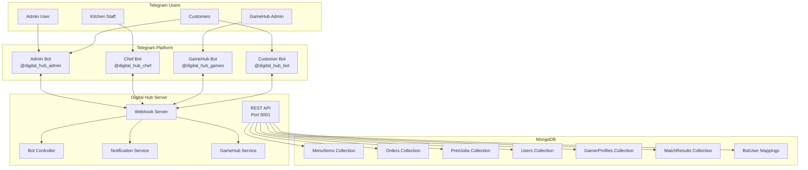

# Telegram Bot System Architecture Plan

## Overview

This document outlines the architecture for a 24/7 Telegram bot system that bridges your Digital Hub app backend with Telegram, enabling real-time management through dedicated bots for admins, kitchen staff, and customers.

## System Architecture



## Bot Types and Responsibilities

### 1. Admin Bot (`@digital_hub_admin`)

**Purpose:** Complete backend management from Telegram

**Capabilities:**

- **Menu Management**
  - View all menu items
  - Add new menu items
  - Edit existing menu items (name, price, category, image)
  - Delete menu items
  - Toggle item availability

- **Order Management**
  - View all orders (all users)
  - View order details
  - Update order status
  - Cancel orders
  - Assign orders to kitchen staff

- **Print Job Management**
  - View all print jobs
  - View print job details
  - Update print job status
  - Cancel print jobs

- **User/Gamer Profile Management**
  - View user profiles
  - Edit user details
  - View order history
  - Manage user access

- **GameHub Admin**
  - Record match results
  - View all match results
  - View player statistics
  - Manage gamer profiles

### 2. Chef Bot (`@digital_hub_chef`)

**Purpose:** Kitchen order management and real-time notifications

**Capabilities:**

- **Order Notifications**
  - Receive instant notifications when new orders are placed
  - View pending orders
  - View order details (items, quantities, special notes)

- **Order Status Updates**
  - Mark orders as "preparing"
  - Mark orders as "ready"
  - Mark orders as "out-for-delivery"
  - Mark orders as "delivered"

- **Order Queue**
  - View all active orders
  - Sort by time, status, or priority
  - Filter by order type

### 3. GameHub Bot (`@digital_hub_games`)

**Purpose:** Record match results for the GameHub 1v1 FC26 kickoff sessions

**Capabilities:**

- **Match Recording**
  - Record new match results
  - Input player usernames
  - Select teams used
  - Input match score
  - Add match date/time

- **Match Management**
  - View recent matches
  - View matches by player
  - View match details
  - Edit match results

- **Player Statistics**
  - Calculate win rate
  - Calculate goal statistics
  - Calculate win streaks
  - Generate player rankings

**Match Recording Workflow:**

```
Admin starts match recording → Enter player 1 username → Enter player 2 username
→ Select team for player 1 → Select team for player 2 → Enter score
→ Confirm and save → Match added to database → Gamer profiles updated
```

### 4. Customer Bot (`@digital_hub_bot`)

**Purpose:** Customer-facing bot for order placement and tracking

**Capabilities:**

- **Order Placement**
  - Browse menu items
  - Add items to cart
  - View cart
  - Place orders
  - View order history

- **Order Tracking**
  - Real-time order status updates
  - Order notifications
  - Order history
  - Cancel pending orders

- **Account Management**
  - View profile
  - Update profile
  - View order history

**Customer Workflow:**

```
Start → View Menu → Add Items → View Cart → Place Order → Track Order
```

## Database Schema Updates

### BotUser Model (New)

```javascript
// models/BotUser.js
const mongoose = require("mongoose");

const BotUserSchema = new mongoose.Schema({
  telegramId: {
    type: String,
    required: true,
    unique: true,
  },
  username: {
    type: String,
    trim: true,
  },
  firstName: {
    type: String,
    required: true,
  },
  lastName: {
    type: String,
  },
  role: {
    type: String,
    enum: ["admin", "chef", "game_admin", "customer"],
    required: true,
  },
  linkedUserId: {
    type: mongoose.Schema.Types.ObjectId,
    ref: "User",
    default: null,
  },
  isActive: {
    type: Boolean,
    default: true,
  },
  notificationsEnabled: {
    type: Boolean,
    default: true,
  },
  createdAt: {
    type: Date,
    default: Date.now,
  },
  lastActive: {
    type: Date,
    default: Date.now,
  },
});

module.exports = mongoose.model("BotUser", BotUserSchema);
```

### GamerProfile Model (New)

```javascript
// models/GamerProfile.js
const mongoose = require("mongoose");

const GamerProfileSchema = new mongoose.Schema({
  userId: {
    type: mongoose.Schema.Types.ObjectId,
    ref: "User",
    required: true,
    unique: true,
  },
  gamerUsername: {
    type: String,
    required: true,
    unique: true,
    trim: true,
  },
  favoriteTeam: {
    type: String,
    required: true,
  },
  avatar: {
    type: String,
    required: true,
  },
  stats: {
    matchesPlayed: {
      type: Number,
      default: 0,
    },
    wins: {
      type: Number,
      default: 0,
    },
    losses: {
      type: Number,
      default: 0,
    },
    draws: {
      type: Number,
      default: 0,
    },
    goalsScored: {
      type: Number,
      default: 0,
    },
    goalsConceded: {
      type: Number,
      default: 0,
    },
    currentStreak: {
      type: Number,
      default: 0,
    },
    longestStreak: {
      type: Number,
      default: 0,
    },
    winRate: {
      type: Number,
      default: 0,
    },
  },
  recentMatches: [
    {
      type: mongoose.Schema.Types.ObjectId,
      ref: "MatchResult",
    },
  ],
  achievements: [
    {
      type: String,
    },
  ],
  createdAt: {
    type: Date,
    default: Date.now,
  },
  updatedAt: {
    type: Date,
    default: Date.now,
  },
});

// Calculate win rate before saving
GamerProfileSchema.pre("save", function (next) {
  if (this.stats.matchesPlayed > 0) {
    this.stats.winRate = Math.round(
      (this.stats.wins / this.stats.matchesPlayed) * 100,
    );
  }
  this.updatedAt = new Date();
  next();
});

module.exports = mongoose.model("GamerProfile", GamerProfileSchema);
```

### MatchResult Model (New)

```javascript
// models/MatchResult.js
const mongoose = require("mongoose");

const MatchResultSchema = new mongoose.Schema({
  player1Id: {
    type: mongoose.Schema.Types.ObjectId,
    ref: "GamerProfile",
    required: true,
  },
  player2Id: {
    type: mongoose.Schema.Types.ObjectId,
    ref: "GamerProfile",
    required: true,
  },
  player1Username: {
    type: String,
    required: true,
  },
  player2Username: {
    type: String,
    required: true,
  },
  player1Team: {
    type: String,
    required: true,
  },
  player2Team: {
    type: String,
    required: true,
  },
  player1Score: {
    type: Number,
    required: true,
  },
  player2Score: {
    type: Number,
    required: true,
  },
  winnerId: {
    type: mongoose.Schema.Types.ObjectId,
    ref: "GamerProfile",
  },
  matchType: {
    type: String,
    enum: ["1v1", "tournament", "friendly"],
    default: "1v1",
  },
  gameVersion: {
    type: String,
    default: "FC26",
  },
  recordedBy: {
    type: mongoose.Schema.Types.ObjectId,
    ref: "BotUser",
    required: true,
  },
  matchDate: {
    type: Date,
    default: Date.now,
  },
  notes: {
    type: String,
  },
});

// Determine winner before saving
MatchResultSchema.pre("save", function (next) {
  if (this.player1Score > this.player2Score) {
    this.winnerId = this.player1Id;
  } else if (this.player2Score > this.player1Score) {
    this.winnerId = this.player2Id;
  }
  next();
});

module.exports = mongoose.model("MatchResult", MatchResultSchema);
```

### User Model Update

```javascript
// models/User.js update - add gamerProfileId field

UserSchema.add({
  gamerProfileId: {
    type: mongoose.Schema.Types.ObjectId,
    ref: "GamerProfile",
    default: null,
  },
  hasGamerProfile: {
    type: Boolean,
    default: false,
  },
});
```

### Football Teams Reference

```javascript
// config/footballTeams.js
module.exports = [
  { id: "real_madrid", name: "Real Madrid", league: "La Liga" },
  { id: "barcelona", name: "Barcelona", league: "La Liga" },
  { id: "man_city", name: "Manchester City", league: "Premier League" },
  { id: "liverpool", name: "Liverpool", league: "Premier League" },
  { id: "bayern", name: "Bayern Munich", league: "Bundesliga" },
  { id: "psg", name: "Paris Saint-Germain", league: "Ligue 1" },
  { id: "juventus", name: "Juventus", league: "Serie A" },
  { id: "inter", name: "Inter Milan", league: "Serie A" },
  { id: "chelsea", name: "Chelsea", league: "Premier League" },
  { id: "man_utd", name: "Manchester United", league: "Premier League" },
  { id: "arsenal", name: "Arsenal", league: "Premier League" },
  { id: "tottenham", name: "Tottenham", league: "Premier League" },
  { id: "ac_milan", name: "AC Milan", league: "Serie A" },
  { id: "dortmund", name: "Borussia Dortmund", league: "Bundesliga" },
  { id: "atlético", name: "Atlético Madrid", league: "La Liga" },
];

// Avatar options
module.exports.avatars = [
  { id: "messi", name: "Messi", image: "🟢" },
  { id: "ronaldo", name: "Ronaldo", image: "⚫" },
  { id: "neymar", name: "Neymar", image: "🟡" },
  { id: "mbappe", name: "Mbappé", image: "🔵" },
  { id: "haaland", name: "Haaland", image: "⚡" },
  { id: "debruyne", name: "De Bruyne", image: "💎" },
  { id: "vinicius", name: "Vinícius Jr.", image: "🟣" },
  { id: "salah", name: "Salah", image: "🔴" },
  { id: "lewandowski", name: "Lewandowski", image: "🟠" },
  { id: "kane", name: "Kane", image: "🦅" },
];
```

## API Endpoint Additions

### Admin Bot Endpoints

```javascript
// New endpoints to add to server.js

// Get all orders (admin view - no auth restriction)
app.get("/api/admin/orders", async (req, res) => {
  try {
    const orders = await Order.find()
      .populate("userId", "username email")
      .sort({ orderDate: -1 });
    res.json(orders);
  } catch (err) {
    res.status(500).json({ message: err.message });
  }
});

// Update any order status (admin)
app.put("/api/admin/orders/:id/status", async (req, res) => {
  const { status } = req.body;
  try {
    const updatedOrder = await Order.findByIdAndUpdate(
      req.params.id,
      { status },
      { new: true, runValidators: true },
    ).populate("userId", "username email");

    if (!updatedOrder) {
      return res.status(404).json({ message: "Order not found" });
    }

    // Trigger notification to user via bot if needed
    res.json(updatedOrder);
  } catch (err) {
    res.status(400).json({ message: err.message });
  }
});

// Get all print jobs (admin)
app.get("/api/admin/print-jobs", async (req, res) => {
  try {
    const printJobs = await PrintJob.find()
      .populate("userId", "username email")
      .sort({ submissionDate: -1 });
    res.json(printJobs);
  } catch (err) {
    res.status(500).json({ message: err.message });
  }
});

// Update print job status (admin)
app.put("/api/admin/print-jobs/:id/status", async (req, res) => {
  const { status } = req.body;
  try {
    const updatedJob = await PrintJob.findByIdAndUpdate(
      req.params.id,
      { status },
      { new: true, runValidators: true },
    ).populate("userId", "username email");

    if (!updatedJob) {
      return res.status(404).json({ message: "Print job not found" });
    }

    res.json(updatedJob);
  } catch (err) {
    res.status(400).json({ message: err.message });
  }
});

// Get all users (admin)
app.get("/api/admin/users", async (req, res) => {
  try {
    const users = await User.find().select("-password");
    res.json(users);
  } catch (err) {
    res.status(500).json({ message: err.message });
  }
});

// Update user profile (admin)
app.put("/api/admin/users/:id", async (req, res) => {
  try {
    const updatedUser = await User.findByIdAndUpdate(req.params.id, req.body, {
      new: true,
      runValidators: true,
    }).select("-password");

    if (!updatedUser) {
      return res.status(404).json({ message: "User not found" });
    }

    res.json(updatedUser);
  } catch (err) {
    res.status(400).json({ message: err.message });
  }
});

// Menu management (existing endpoints work, just need bot integration)
```

### Chef Bot Endpoints

```javascript
// Get pending orders for kitchen
app.get("/api/chef/orders/pending", async (req, res) => {
  try {
    const orders = await Order.find({
      status: { $in: ["pending", "confirmed", "preparing"] },
    })
      .populate("userId", "username")
      .sort({ orderDate: 1 });
    res.json(orders);
  } catch (err) {
    res.status(500).json({ message: err.message });
  }
});

// Update order status (chef)
app.put("/api/chef/orders/:id/status", async (req, res) => {
  const { status } = req.body;
  try {
    const updatedOrder = await Order.findByIdAndUpdate(
      req.params.id,
      { status },
      { new: true, runValidators: true },
    ).populate("userId", "username");

    if (!updatedOrder) {
      return res.status(404).json({ message: "Order not found" });
    }

    res.json(updatedOrder);
  } catch (err) {
    res.status(400).json({ message: err.message });
  }
});

// Get order statistics
app.get("/api/chef/stats", async (req, res) => {
  try {
    const stats = {
      pending: await Order.countDocuments({ status: "pending" }),
      preparing: await Order.countDocuments({ status: "preparing" }),
      ready: await Order.countDocuments({ status: "ready" }),
      todayOrders: await Order.countDocuments({
        orderDate: { $gte: new Date().setHours(0, 0, 0, 0) },
      }),
    };
    res.json(stats);
  } catch (err) {
    res.status(500).json({ message: err.message });
  }
});
```

### GameHub Bot Endpoints

```javascript
// Get all gamer profiles
app.get("/api/game/profiles", async (req, res) => {
  try {
    const profiles = await GamerProfile.find()
      .populate("userId", "username")
      .sort({ "stats.winRate": -1 });
    res.json(profiles);
  } catch (err) {
    res.status(500).json({ message: err.message });
  }
});

// Get gamer profile by ID or username
app.get("/api/game/profile/:identifier", async (req, res) => {
  try {
    const profile = await GamerProfile.findOne({
      $or: [
        { _id: req.params.identifier },
        { gamerUsername: req.params.identifier },
      ],
    })
      .populate("userId", "username")
      .populate("recentMatches");

    if (!profile) {
      return res.status(404).json({ message: "Gamer profile not found" });
    }
    res.json(profile);
  } catch (err) {
    res.status(500).json({ message: err.message });
  }
});

// Create gamer profile
app.post("/api/game/profile", async (req, res) => {
  const { userId, gamerUsername, favoriteTeam, avatar } = req.body;
  try {
    // Check if username is taken
    const existingProfile = await GamerProfile.findOne({ gamerUsername });
    if (existingProfile) {
      return res.status(400).json({ message: "Username is already taken" });
    }

    const profile = new GamerProfile({
      userId,
      gamerUsername,
      favoriteTeam,
      avatar,
    });

    await profile.save();

    // Update user with gamer profile ID
    await User.findByIdAndUpdate(userId, {
      gamerProfileId: profile._id,
      hasGamerProfile: true,
    });

    res.status(201).json(profile);
  } catch (err) {
    res.status(400).json({ message: err.message });
  }
});

// Record match result (GameHub Admin)
app.post("/api/game/match", async (req, res) => {
  const {
    player1Id,
    player2Id,
    player1Team,
    player2Team,
    player1Score,
    player2Score,
    recordedBy,
    matchType = "1v1",
  } = req.body;

  try {
    // Get player usernames
    const player1 = await GamerProfile.findById(player1Id);
    const player2 = await GamerProfile.findById(player2Id);

    if (!player1 || !player2) {
      return res.status(404).json({ message: "Player not found" });
    }

    const match = new MatchResult({
      player1Id,
      player2Id,
      player1Username: player1.gamerUsername,
      player2Username: player2.gamerUsername,
      player1Team,
      player2Team,
      player1Score,
      player2Score,
      recordedBy,
      matchType,
    });

    await match.save();

    // Update player statistics
    await updateGamerStats(player1Id, match);
    await updateGamerStats(player2Id, match);

    res.status(201).json(match);
  } catch (err) {
    res.status(400).json({ message: err.message });
  }
});

// Get all matches
app.get("/api/game/matches", async (req, res) => {
  try {
    const { limit = 50, playerId } = req.query;
    const query = playerId
      ? {
          $or: [{ player1Id: playerId }, { player2Id: playerId }],
        }
      : {};

    const matches = await MatchResult.find(query)
      .sort({ matchDate: -1 })
      .limit(parseInt(limit));
    res.json(matches);
  } catch (err) {
    res.status(500).json({ message: err.message });
  }
});

// Get player rankings
app.get("/api/game/rankings", async (req, res) => {
  try {
    const rankings = await GamerProfile.find()
      .sort({ "stats.winRate": -1, "stats.goalsScored": -1 })
      .limit(20);
    res.json(rankings);
  } catch (err) {
    res.status(500).json({ message: err.message });
  }
});

// Helper function to update gamer stats
async function updateGamerStats(profileId, match) {
  const profile = await GamerProfile.findById(profileId);

  profile.stats.matchesPlayed += 1;

  if (match.winnerId.toString() === profileId.toString()) {
    profile.stats.wins += 1;
    profile.stats.currentStreak += 1;
    if (profile.stats.currentStreak > profile.stats.longestStreak) {
      profile.stats.longestStreak = profile.stats.currentStreak;
    }
  } else if (match.winnerId === null) {
    profile.stats.draws += 1;
    profile.stats.currentStreak = 0;
  } else {
    profile.stats.losses += 1;
    profile.stats.currentStreak = 0;
  }

  if (profileId.toString() === match.player1Id.toString()) {
    profile.stats.goalsScored += match.player1Score;
    profile.stats.goalsConceded += match.player2Score;
  } else {
    profile.stats.goalsScored += match.player2Score;
    profile.stats.goalsConceded += match.player1Score;
  }

  // Add to recent matches
  profile.recentMatches.unshift(match._id);
  if (profile.recentMatches.length > 10) {
    profile.recentMatches.pop();
  }

  await profile.save();
}
```

### Customer Bot Endpoints

```javascript
// Get menu for customer
app.get("/api/customer/menu", async (req, res) => {
  try {
    const menuItems = await MenuItem.find({ available: { $ne: false } });
    res.json(menuItems);
  } catch (err) {
    res.status(500).json({ message: err.message });
  }
});

// Get customer orders (by telegram ID)
app.get("/api/customer/orders/:telegramId", async (req, res) => {
  try {
    const botUser = await BotUser.findOne({
      telegramId: req.params.telegramId,
      role: "customer",
    });

    if (!botUser || !botUser.linkedUserId) {
      return res.status(404).json({ message: "Customer not found" });
    }

    const orders = await Order.find({ userId: botUser.linkedUserId }).sort({
      orderDate: -1,
    });
    res.json(orders);
  } catch (err) {
    res.status(500).json({ message: err.message });
  }
});

// Track order by order ID
app.get("/api/customer/order/:orderId/track", async (req, res) => {
  try {
    const order = await Order.findById(req.params.orderId).populate(
      "items.menuItemId",
      "name price",
    );

    if (!order) {
      return res.status(404).json({ message: "Order not found" });
    }

    res.json({
      id: order._id,
      status: order.status,
      items: order.items,
      totalAmount: order.totalAmount,
      orderDate: order.orderDate,
      estimatedTime: order.estimatedTime,
      timeline: [
        { status: "pending", time: order.orderDate },
        { status: "confirmed", time: order.confirmedAt },
        { status: "preparing", time: order.preparingAt },
        { status: "ready", time: order.readyAt },
        { status: "delivered", time: order.deliveredAt },
      ].filter((t) => t.time),
    });
  } catch (err) {
    res.status(500).json({ message: err.message });
  }
});

// Create order (customer)
app.post("/api/customer/orders", async (req, res) => {
  const { telegramId, items, totalAmount } = req.body;
  try {
    const botUser = await BotUser.findOne({
      telegramId,
      role: "customer",
    });

    if (!botUser || !botUser.linkedUserId) {
      return res.status(401).json({ message: "Customer not authenticated" });
    }

    const order = new Order({
      userId: botUser.linkedUserId,
      items,
      totalAmount,
    });

    await order.save();

    // Send notification to kitchen
    OrderNotifier.notifyNewOrder(order);

    res.status(201).json(order);
  } catch (err) {
    res.status(400).json({ message: err.message });
  }
});
```

## Telegram Bot Implementation

### Bot Service Base Class (with Webhook Support)

```javascript
// services/telegram/BotService.js
const TelegramBot = require("node-telegram-bot-api");

class BotService {
  constructor(token, adminChatId, useWebhook = false) {
    this.token = token;
    this.adminChatId = adminChatId;
    this.useWebhook = useWebhook;

    if (useWebhook) {
      const webhookUrl = process.env.WEBHOOK_URL;
      this.bot = new TelegramBot(token, {
        webHook: {
          port: process.env.WEBHOOK_PORT || 5002,
          autoOpen: false,
        },
      });
      this.bot.setWebHook(`${webhookUrl}/bot${token}`);
    } else {
      this.bot = new TelegramBot(token, { polling: true });
    }
  }

  async sendMessage(chatId, text, options = {}) {
    try {
      return await this.bot.sendMessage(chatId, text, {
        parse_mode: "HTML",
        ...options,
      });
    } catch (error) {
      console.error("Error sending message:", error);
    }
  }

  async sendOrderNotification(order) {
    const itemsList = order.items
      .map((item) => `• ${item.name} x${item.qty} - ₦${item.price}`)
      .join("\n");

    const message = `
<b>🆕 New Order #${order._id.toString().slice(-6)}</b>

<b>Customer:</b> ${order.userId?.username || "Guest"}
<b>Time:</b> ${new Date(order.orderDate).toLocaleString()}
<b>Total:</b> ₦${order.totalAmount}

<b>Items:</b>
${itemsList}

<b>Status:</b> ${order.status}
        `;

    return this.sendMessage(this.adminChatId, message, {
      reply_markup: {
        inline_keyboard: [
          [
            { text: "✅ Accept", callback_data: `order_accept_${order._id}` },
            { text: "❌ Reject", callback_data: `order_reject_${order._id}` },
          ],
          [
            {
              text: "👨‍🍳 Assign to Kitchen",
              callback_data: `order_assign_${order._id}`,
            },
          ],
        ],
      },
    });
  }

  async sendStatusUpdate(order, oldStatus, newStatus) {
    const emoji = {
      pending: "⏳",
      confirmed: "✅",
      preparing: "👨‍🍳",
      ready: "🍽️",
      "out-for-delivery": "🚗",
      delivered: "🎉",
      cancelled: "❌",
    };

    const message = `
${emoji[newStatus]} <b>Order Status Update</b>

Order #${order._id.toString().slice(-6)}
${emoji[oldStatus]} ${oldStatus} → ${emoji[newStatus]} ${newStatus}

${order.userId?.username ? `Customer: ${order.userId.username}` : ""}
        `;

    return this.sendMessage(this.adminChatId, message);
  }

  processUpdate(update) {
    this.bot.processUpdate(update);
  }
}

module.exports = BotService;
```

### Admin Bot Commands

```javascript
// services/telegram/AdminBot.js
const BotService = require("./BotService");

class AdminBot extends BotService {
  constructor(token, adminChatId, useWebhook = false) {
    super(token, adminChatId, useWebhook);
    this.setupCommands();
  }

  setupCommands() {
    // Menu commands
    this.bot.onText(/\/menu/, (msg) => this.showMenu(msg));
    this.bot.onText(/\/addmenu/, (msg) => this.startAddMenu(msg));
    this.bot.onText(/\/editmenu (.+)/, (msg, match) =>
      this.startEditMenu(msg, match[1]),
    );
    this.bot.onText(/\/deletemenu (.+)/, (msg, match) =>
      this.deleteMenu(msg, match[1]),
    );

    // Order commands
    this.bot.onText(/\/orders/, (msg) => this.showOrders(msg));
    this.bot.onText(/\/order (.+)/, (msg, match) =>
      this.showOrderDetails(msg, match[1]),
    );
    this.bot.onText(/\/startorder (.+)/, (msg, match) =>
      this.startOrder(msg, match[1]),
    );
    this.bot.onText(/\/completeorder (.+)/, (msg, match) =>
      this.completeOrder(msg, match[1]),
    );

    // Print commands
    this.bot.onText(/\/prints/, (msg) => this.showPrintJobs(msg));
    this.bot.onText(/\/print (.+)/, (msg, match) =>
      this.showPrintDetails(msg, match[1]),
    );

    // User commands
    this.bot.onText(/\/users/, (msg) => this.showUsers(msg));
    this.bot.onText(/\/user (.+)/, (msg, match) =>
      this.showUserDetails(msg, match[1]),
    );

    // GameHub commands
    this.bot.onText(/\/game/, (msg) => this.showGameHub(msg));
    this.bot.onText(/\/recordmatch/, (msg) => this.startRecordMatch(msg));
    this.bot.onText(/\/match (.+)/, (msg, match) =>
      this.showMatchDetails(msg, match[1]),
    );
    this.bot.onText(/\/gamer (.+)/, (msg, match) =>
      this.showGamerProfile(msg, match[1]),
    );
    this.bot.onText(/\/rankings/, (msg) => this.showRankings(msg));

    // Callback queries
    this.bot.on("callback_query", (query) => this.handleCallback(query));
  }

  async showMenu(msg) {
    const MenuItem = require("../../models/MenuItem");
    const items = await MenuItem.find();

    const menuText = items
      .map(
        (item) =>
          `${item.category}: ${item.name} - ₦${item.price} ${item.imageUrl ? "🖼️" : ""}`,
      )
      .join("\n");

    this.sendMessage(
      msg.chat.id,
      `<b>📋 Menu Items</b>\n\n${menuText || "No items yet"}`,
      {
        reply_markup: {
          inline_keyboard: [
            [{ text: "➕ Add Item", callback_data: "menu_add" }],
            [{ text: "🔄 Refresh", callback_data: "menu_refresh" }],
          ],
        },
      },
    );
  }

  async showOrders(msg) {
    const Order = require("../../models/Order");
    const orders = await Order.find()
      .populate("userId", "username")
      .sort({ orderDate: -1 })
      .limit(20);

    const ordersText = orders
      .map((order) => {
        const statusEmoji = {
          pending: "⏳",
          confirmed: "✅",
          preparing: "👨‍🍳",
          ready: "🍽️",
          delivered: "🎉",
          cancelled: "❌",
        };
        return `${statusEmoji[order.status]} #${order._id.toString().slice(-6)} - ${order.userId?.username || "Guest"} - ₦${order.totalAmount}`;
      })
      .join("\n");

    this.sendMessage(
      msg.chat.id,
      `<b>📦 Recent Orders</b>\n\n${ordersText || "No orders"}`,
      {
        reply_markup: {
          inline_keyboard: [
            [{ text: "🔄 Refresh", callback_data: "orders_refresh" }],
            [{ text: "👨‍🍳 Kitchen View", callback_data: "orders_kitchen" }],
          ],
        },
      },
    );
  }

  async showPrintJobs(msg) {
    const PrintJob = require("../../models/PrintJob");
    const jobs = await PrintJob.find()
      .populate("userId", "username")
      .sort({ submissionDate: -1 })
      .limit(20);

    const printsText = jobs
      .map((job) => {
        const statusEmoji = {
          pending: "⏳",
          processing: "🖨️",
          completed: "✅",
          cancelled: "❌",
          "awaiting-payment": "💰",
        };
        return `${statusEmoji[job.status]} ${job.fileName} - ${job.numPages} pages - ₦${job.price}`;
      })
      .join("\n");

    this.sendMessage(
      msg.chat.id,
      `<b>🖨️ Print Jobs</b>\n\n${printsText || "No print jobs"}`,
      {
        reply_markup: {
          inline_keyboard: [
            [{ text: "🔄 Refresh", callback_data: "prints_refresh" }],
          ],
        },
      },
    );
  }

  async showUsers(msg) {
    const User = require("../../models/User");
    const users = await User.find()
      .select("-password")
      .sort({ createdAt: -1 })
      .limit(20);

    const usersText = users
      .map((user) => `👤 ${user.username} - ${user.email}`)
      .join("\n");

    this.sendMessage(
      msg.chat.id,
      `<b>👥 Users</b>\n\n${usersText || "No users"}`,
      {
        reply_markup: {
          inline_keyboard: [
            [{ text: "🔄 Refresh", callback_data: "users_refresh" }],
          ],
        },
      },
    );
  }

  async showGameHub(msg) {
    const MatchResult = require("../../models/MatchResult");
    const GamerProfile = require("../../models/GamerProfile");

    const recentMatches = await MatchResult.find()
      .sort({ matchDate: -1 })
      .limit(5);
    const topGamers = await GamerProfile.find()
      .sort({ "stats.winRate": -1 })
      .limit(5);

    const matchesText = recentMatches
      .map(
        (m) =>
          `${m.player1Username} ${m.player1Score}-${m.player2Score} ${m.player2Username}`,
      )
      .join("\n");

    const gamersText = topGamers
      .map((g, i) => `${i + 1}. ${g.gamerUsername} - ${g.stats.winRate}% WR`)
      .join("\n");

    this.sendMessage(
      msg.chat.id,
      `
<b>🎮 GameHub Dashboard</b>

<b>🏆 Top Gamer Rankings</b>
${gamersText || "No gamers yet"}

<b>🕐 Recent Matches</b>
${matchesText || "No matches recorded"}

Use /recordmatch to record a new match
Use /rankings to see all rankings
        `,
      {
        reply_markup: {
          inline_keyboard: [
            [{ text: "🎮 Record Match", callback_data: "game_record" }],
            [{ text: "🏆 Rankings", callback_data: "game_rankings" }],
            [{ text: "👤 View Gamer", callback_data: "game_view_gamer" }],
          ],
        },
      },
    );
  }

  async startRecordMatch(msg) {
    this.sendMessage(
      msg.chat.id,
      `
<b>🎮 Record New Match</b>

Please provide the following information:
1. Player 1 username
2. Player 2 username
3. Team for Player 1
4. Team for Player 2
5. Final Score (e.g., 3-2)

Format:
/matchresult [player1] [player2] [team1] [team2] [score]
Example:
/matchresult john_doe jane_smith real_madrid barcelona 3-2
        `,
    );
  }

  async showMatchDetails(msg, matchId) {
    const MatchResult = require("../../models/MatchResult");
    const match = await MatchResult.findById(matchId);

    if (!match) {
      return this.sendMessage(msg.chat.id, "Match not found");
    }

    const winner =
      match.player1Score > match.player2Score
        ? match.player1Username
        : match.player2Score > match.player1Score
          ? match.player2Username
          : "Draw";

    this.sendMessage(
      msg.chat.id,
      `
<b>⚽ Match Details</b>

<b>Players:</b>
${match.player1Username} (${match.player1Team}) ${match.player1Score} - ${match.player2Score} (${match.player2Team}) ${match.player2Username}

<b>Winner:</b> ${winner}
<b>Date:</b> ${new Date(match.matchDate).toLocaleString()}
<b>Game:</b> ${match.gameVersion}
<b>Type:</b> ${match.matchType}
        `,
    );
  }

  async showGamerProfile(msg, identifier) {
    const GamerProfile = require("../../models/GamerProfile");
    const profile = await GamerProfile.findOne({
      $or: [{ _id: identifier }, { gamerUsername: identifier }],
    }).populate("recentMatches");

    if (!profile) {
      return this.sendMessage(msg.chat.id, "Gamer profile not found");
    }

    this.sendMessage(
      msg.chat.id,
      `
<b>👤 ${profile.gamerUsername}</b>

🏟️ <b>Team:</b> ${profile.favoriteTeam}
📊 <b>Statistics</b>
   Matches: ${profile.stats.matchesPlayed}
   Wins: ${profile.stats.wins}
   Losses: ${profile.stats.losses}
   Draws: ${profile.stats.draws}
   Win Rate: ${profile.stats.winRate}%
   
⚽ <b>Goals</b>
   Scored: ${profile.stats.goalsScored}
   Conceded: ${profile.stats.goalsConceded}
   
🔥 <b>Streaks</b>
   Current: ${profile.stats.currentStreak}
   Longest: ${profile.stats.longestStreak}
        `,
    );
  }

  async showRankings(msg) {
    const GamerProfile = require("../../models/GamerProfile");
    const rankings = await GamerProfile.find()
      .sort({ "stats.winRate": -1, "stats.goalsScored": -1 })
      .limit(20);

    const rankingsText = rankings
      .map(
        (g, i) =>
          `${i + 1}. ${g.gamerUsername} - ${g.stats.wins}W ${g.stats.losses}L (${g.stats.winRate}%) - ${g.stats.goalsScored} goals`,
      )
      .join("\n");

    this.sendMessage(
      msg.chat.id,
      `<b>🏆 Gamer Rankings</b>\n\n${rankingsText}`,
      {
        reply_markup: {
          inline_keyboard: [
            [{ text: "🔄 Refresh", callback_data: "rankings_refresh" }],
          ],
        },
      },
    );
  }

  async handleCallback(query) {
    const [action, type, id] = query.data.split("_");

    switch (action) {
      case "order":
        await this.handleOrderCallback(type, id, query);
        break;
      case "menu":
        await this.handleMenuCallback(type, id, query);
        break;
      case "print":
        await this.handlePrintCallback(type, id, query);
        break;
      case "game":
        await this.handleGameCallback(type, id, query);
        break;
    }

    this.bot.answerCallbackQuery(query.id);
  }
}

module.exports = AdminBot;
```

### Chef Bot Commands

```javascript
// services/telegram/ChefBot.js
const BotService = require("./BotService");

class ChefBot extends BotService {
  constructor(token, adminChatId, useWebhook = false) {
    super(token, adminChatId, useWebhook);
    this.setupCommands();
  }

  setupCommands() {
    // Kitchen commands
    this.bot.onText(/\/kitchen/, (msg) => this.showKitchen(msg));
    this.bot.onText(/\/new/, (msg) => this.showNewOrders(msg));
    this.bot.onText(/\/preparing/, (msg) => this.showPreparingOrders(msg));
    this.bot.onText(/\/ready/, (msg) => this.showReadyOrders(msg));
    this.bot.onText(/\/stats/, (msg) => this.showStats(msg));

    // Order actions
    this.bot.onText(/\/start (.+)/, (msg, match) =>
      this.startPreparing(msg, match[1]),
    );
    this.bot.onText(/\/ready (.+)/, (msg, match) =>
      this.markReady(msg, match[1]),
    );
    this.bot.onText(/\/deliver (.+)/, (msg, match) =>
      this.markDelivered(msg, match[1]),
    );

    // Callback queries
    this.bot.on("callback_query", (query) => this.handleChefCallback(query));
  }

  async showKitchen(msg) {
    const Order = require("../../models/Order");
    const stats = await this.getOrderStats();

    const message = `
<b>👨‍🍳 Kitchen Dashboard</b>

⏳ Pending: ${stats.pending}
👨‍🍳 Preparing: ${stats.preparing}
🍽️ Ready: ${stats.ready}
📅 Today: ${stats.today}

Use /new, /preparing, /ready to view each queue
        `;

    this.sendMessage(msg.chat.id, message, {
      reply_markup: {
        inline_keyboard: [
          [{ text: "⏳ New Orders", callback_data: "kitchen_new" }],
          [{ text: "👨‍🍳 Preparing", callback_data: "kitchen_preparing" }],
          [{ text: "🍽️ Ready", callback_data: "kitchen_ready" }],
          [{ text: "📊 Stats", callback_data: "kitchen_stats" }],
        ],
      },
    });
  }

  async showNewOrders(msg) {
    const Order = require("../../models/Order");
    const orders = await Order.find({ status: "pending" })
      .populate("userId", "username")
      .sort({ orderDate: 1 });

    if (orders.length === 0) {
      return this.sendMessage(msg.chat.id, "✅ No new orders");
    }

    const ordersText = orders
      .map((order, index) => {
        const itemsList = order.items
          .slice(0, 3)
          .map((item) => `${item.name} x${item.qty}`)
          .join(", ");
        const more =
          order.items.length > 3 ? ` +${order.items.length - 3} more` : "";

        return `${index + 1}. #${order._id.toString().slice(-6)} - ${order.userId?.username || "Guest"}
   ${itemsList}${more} - ₦${order.totalAmount}
   🕐 ${new Date(order.orderDate).toLocaleTimeString()}`;
      })
      .join("\n\n");

    this.sendMessage(
      msg.chat.id,
      `<b>⏳ New Orders (${orders.length})</b>\n\n${ordersText}`,
      {
        reply_markup: {
          inline_keyboard: orders.map((order) => [
            {
              text: `Start #${order._id.toString().slice(-6)}`,
              callback_data: `chef_start_${order._id}`,
            },
          ]),
        },
      },
    );
  }

  async showPreparingOrders(msg) {
    const Order = require("../../models/Order");
    const orders = await Order.find({ status: "preparing" })
      .populate("userId", "username")
      .sort({ orderDate: 1 });

    if (orders.length === 0) {
      return this.sendMessage(
        msg.chat.id,
        "✅ No orders currently being prepared",
      );
    }

    const ordersText = orders
      .map((order, index) => {
        const itemsList = order.items
          .map((item) => `${item.name} x${item.qty}`)
          .join("\n   ");

        return `${index + 1}. #${order._id.toString().slice(-6)} - ${order.userId?.username || "Guest"}
   ${itemsList}
   🕐 Started: ${new Date(order.orderDate).toLocaleTimeString()}`;
      })
      .join("\n\n");

    this.sendMessage(
      msg.chat.id,
      `<b>👨‍🍳 Preparing (${orders.length})</b>\n\n${ordersText}`,
      {
        reply_markup: {
          inline_keyboard: orders.map((order) => [
            {
              text: `Ready #${order._id.toString().slice(-6)}`,
              callback_data: `chef_ready_${order._id}`,
            },
          ]),
        },
      },
    );
  }

  async showReadyOrders(msg) {
    const Order = require("../../models/Order");
    const orders = await Order.find({ status: "ready" })
      .populate("userId", "username")
      .sort({ orderDate: 1 });

    if (orders.length === 0) {
      return this.sendMessage(
        msg.chat.id,
        "✅ No orders ready for pickup/delivery",
      );
    }

    const ordersText = orders
      .map((order, index) => {
        return `${index + 1}. #${order._id.toString().slice(-6)} - ${order.userId?.username || "Guest"} - ₦${order.totalAmount}`;
      })
      .join("\n");

    this.sendMessage(
      msg.chat.id,
      `<b>🍽️ Ready for Pickup (${orders.length})</b>\n\n${ordersText}`,
      {
        reply_markup: {
          inline_keyboard: orders.map((order) => [
            {
              text: `Delivered #${order._id.toString().slice(-6)}`,
              callback_data: `chef_deliver_${order._id}`,
            },
          ]),
        },
      },
    );
  }

  async showStats(msg) {
    const stats = await this.getOrderStats();

    this.sendMessage(
      msg.chat.id,
      `
<b>📊 Kitchen Statistics</b>

⏳ Pending: ${stats.pending}
👨‍🍳 Preparing: ${stats.preparing}
🍽️ Ready: ${stats.ready}
📦 Completed Today: ${stats.completed}

🕐 Updated: ${new Date().toLocaleTimeString()}
        `,
    );
  }

  async getOrderStats() {
    const Order = require("../../models/Order");
    const today = new Date();
    today.setHours(0, 0, 0, 0);

    return {
      pending: await Order.countDocuments({ status: "pending" }),
      preparing: await Order.countDocuments({ status: "preparing" }),
      ready: await Order.countDocuments({ status: "ready" }),
      completed: await Order.countDocuments({
        status: "delivered",
        orderDate: { $gte: today },
      }),
      today: await Order.countDocuments({ orderDate: { $gte: today } }),
    };
  }

  async handleChefCallback(query) {
    const [action, type, orderId] = query.data.split("_");

    switch (action) {
      case "chef":
        await this.handleChefAction(type, orderId, query);
        break;
      case "kitchen":
        await this.handleKitchenView(type, query);
        break;
    }

    this.bot.answerCallbackQuery(query.id);
  }

  async handleChefAction(type, orderId, query) {
    const Order = require("../../models/Order");
    const order = await Order.findById(orderId).populate("userId", "username");

    if (!order) {
      return this.bot.sendMessage(query.message.chat.id, "Order not found");
    }

    const statusMap = {
      start: "preparing",
      ready: "ready",
      deliver: "delivered",
    };

    const oldStatus = order.status;
    const newStatus = statusMap[type];

    order.status = newStatus;
    await order.save();

    // Send confirmation
    this.bot.sendMessage(
      query.message.chat.id,
      `✅ Order #${order._id.toString().slice(-6)} marked as ${newStatus}`,
    );

    // Update the original message
    this.bot.editMessageReplyMarkup(
      { inline_keyboard: [] },
      {
        chat_id: query.message.chat.id,
        message_id: query.message.message_id,
      },
    );
  }
}

module.exports = ChefBot;
```

### GameHub Bot Commands

```javascript
// services/telegram/GameHubBot.js
const BotService = require("./BotService");

class GameHubBot extends BotService {
  constructor(token, adminChatId, useWebhook = false) {
    super(token, adminChatId, useWebhook);
    this.setupCommands();
  }

  setupCommands() {
    // Match recording
    this.bot.onText(/\/record/, (msg) => this.startRecordMatch(msg));
    this.bot.onText(/\/matchresult (.+)/, (msg, match) =>
      this.recordMatch(msg, match[1]),
    );

    // View commands
    this.bot.onText(/\/matches/, (msg) => this.showRecentMatches(msg));
    this.bot.onText(/\/gamer (.+)/, (msg, match) =>
      this.showGamerProfile(msg, match[1]),
    );
    this.bot.onText(/\/rankings/, (msg) => this.showRankings(msg));
    this.bot.onText(/\/stats/, (msg) => this.showStats(msg));

    // Callback queries
    this.bot.on("callback_query", (query) => this.handleCallback(query));
  }

  async startRecordMatch(msg) {
    this.sendMessage(
      msg.chat.id,
      `
<b>🎮 Record New FC26 Match</b>

Please enter match details in the following format:
/matchresult [player1_username] [player2_username] [team1] [team2] [score]

<b>Available Teams:</b>
Real Madrid, Barcelona, Man City, Liverpool, Bayern, PSG, Juventus, Inter, Chelsea, Man Utd, Arsenal, Tottenham, AC Milan, Dortmund, Atlético

<b>Example:</b>
/matchresult john_doe jane_smith real_madrid barcelona 3-2

This will record:
- John Doe (Real Madrid) vs Jane Smith (Barcelona)
- Final score: 3-2
- Winner: John Doe
        `,
    );
  }

  async recordMatch(msg, matchData) {
    const MatchResult = require("../../models/MatchResult");
    const GamerProfile = require("../../models/GamerProfile");
    const BotUser = require("../../models/BotUser");

    try {
      // Parse match data
      const parts = matchData.split(" ");
      if (parts.length < 5) {
        return this.sendMessage(
          msg.chat.id,
          "Invalid format. Use:\n/matchresult player1 player2 team1 team2 score",
        );
      }

      // Extract data (handle spaces in team names by using underscores)
      const player1 = parts[0];
      const player2 = parts[1];
      const team1 = parts[2].replace(/_/g, " ");
      const team2 = parts[3].replace(/_/g, " ");
      const scoreParts = parts[4].split("-");

      if (scoreParts.length !== 2) {
        return this.sendMessage(msg.chat.id, "Invalid score format. Use: 3-2");
      }

      const player1Score = parseInt(scoreParts[0]);
      const player2Score = parseInt(scoreParts[1]);

      // Find gamer profiles
      const profile1 = await GamerProfile.findOne({ gamerUsername: player1 });
      const profile2 = await GamerProfile.findOne({ gamerUsername: player2 });

      if (!profile1 || !profile2) {
        return this.sendMessage(
          msg.chat.id,
          `Player not found: ${!profile1 ? player1 : player2}\nPlease ensure both players have created gamer profiles.`,
        );
      }

      // Get bot user (admin who recorded)
      const botUser = await BotUser.findOne({
        telegramId: msg.from.id.toString(),
      });

      // Create match record
      const match = new MatchResult({
        player1Id: profile1._id,
        player2Id: profile2._id,
        player1Username: profile1.gamerUsername,
        player2Username: profile2.gamerUsername,
        player1Team: team1,
        player2Team: team2,
        player1Score,
        player2Score,
        recordedBy: botUser?._id,
        gameVersion: "FC26",
        matchType: "1v1",
      });

      await match.save();

      // Update player stats
      await this.updatePlayerStats(profile1._id, match);
      await this.updatePlayerStats(profile2._id, match);

      // Determine winner
      const winner =
        player1Score > player2Score
          ? profile1.gamerUsername
          : player2Score > player1Score
            ? profile2.gamerUsername
            : "Draw";

      this.sendMessage(
        msg.chat.id,
        `
<b>✅ Match Recorded Successfully!</b>

⚽ ${profile1.gamerUsername} (${team1}) ${player1Score} - ${player2Score} (${team2}) ${profile2.gamerUsername}

🏆 Winner: ${winner}
📅 Date: ${new Date(match.matchDate).toLocaleString()}
🎮 Game: FC26

Stats have been updated for both players.
            `,
      );
    } catch (error) {
      console.error("Error recording match:", error);
      this.sendMessage(msg.chat.id, "Error recording match. Please try again.");
    }
  }

  async updatePlayerStats(profileId, match) {
    const GamerProfile = require("../../models/GamerProfile");
    const profile = await GamerProfile.findById(profileId);

    profile.stats.matchesPlayed += 1;

    if (match.winnerId) {
      if (match.winnerId.toString() === profileId.toString()) {
        profile.stats.wins += 1;
        profile.stats.currentStreak += 1;
        if (profile.stats.currentStreak > profile.stats.longestStreak) {
          profile.stats.longestStreak = profile.stats.currentStreak;
        }
      } else {
        profile.stats.losses += 1;
        profile.stats.currentStreak = 0;
      }
    } else {
      profile.stats.draws += 1;
      profile.stats.currentStreak = 0;
    }

    if (profileId.toString() === match.player1Id.toString()) {
      profile.stats.goalsScored += match.player1Score;
      profile.stats.goalsConceded += match.player2Score;
    } else {
      profile.stats.goalsScored += match.player2Score;
      profile.stats.goalsConceded += match.player1Score;
    }

    // Add to recent matches
    profile.recentMatches.unshift(match._id);
    if (profile.recentMatches.length > 10) {
      profile.recentMatches.pop();
    }

    await profile.save();
  }

  async showRecentMatches(msg) {
    const MatchResult = require("../../models/MatchResult");
    const matches = await MatchResult.find().sort({ matchDate: -1 }).limit(10);

    if (matches.length === 0) {
      return this.sendMessage(msg.chat.id, "No matches recorded yet.");
    }

    const matchesText = matches
      .map((m) => {
        const winner =
          m.player1Score > m.player2Score
            ? m.player1Username
            : m.player2Score > m.player1Score
              ? m.player2Username
              : "Draw";
        return `
🏟️ ${m.player1Username} ${m.player1Score}-${m.player2Score} ${m.player2Username}
   Winner: ${winner} | ${m.player1Team} vs ${m.player2Team}
   ${new Date(m.matchDate).toLocaleDateString()}`;
      })
      .join("\n");

    this.sendMessage(msg.chat.id, `<b>🕐 Recent Matches</b>\n${matchesText}`);
  }

  async showGamerProfile(msg, identifier) {
    const GamerProfile = require("../../models/GamerProfile");
    const profile = await GamerProfile.findOne({
      $or: [{ _id: identifier }, { gamerUsername: identifier }],
    }).populate("recentMatches");

    if (!profile) {
      return this.sendMessage(msg.chat.id, "Gamer profile not found.");
    }

    const form =
      profile.stats.wins > profile.stats.losses
        ? "🔥 On Fire"
        : profile.stats.wins < profile.stats.losses
          ? "❄️ Cooling Down"
          : "⚖️ Balanced";

    this.sendMessage(
      msg.chat.id,
      `
<b>👤 ${profile.gamerUsername}</b> ${form}

🏟️ Team: ${profile.favoriteTeam}

📊 <b>Season Statistics</b>
   🎮 Matches: ${profile.stats.matchesPlayed}
   ✅ Wins: ${profile.stats.wins}
   ❌ Losses: ${profile.stats.losses}
   🤝 Draws: ${profile.stats.draws}
   📈 Win Rate: ${profile.stats.winRate}%

⚽ <b>Goals</b>
   🥅 Scored: ${profile.stats.goalsScored}
   🧤 Conceded: ${profile.stats.goalsConceded}
   📊 Goal Diff: ${profile.stats.goalsScored - profile.stats.goalsConceded}

🔥 <b>Streaks</b>
   🔥 Current: ${profile.stats.currentStreak}
   🏆 Longest: ${profile.stats.longestStreak}

<b>Recent Matches:</b>
${await this.formatRecentMatches(profile.recentMatches)}
        `,
    );
  }

  async formatRecentMatches(matches) {
    if (!matches || matches.length === 0) return "No matches yet.";

    const MatchResult = require("../../models/MatchResult");
    const formatted = [];

    for (const match of matches.slice(0, 5)) {
      const m = await MatchResult.findById(match);
      if (m) {
        const isPlayer1 = m.player1Username === "username";
        const myScore = isPlayer1 ? m.player1Score : m.player2Score;
        const opponentScore = isPlayer1 ? m.player2Score : m.player1Score;
        const result =
          myScore > opponentScore
            ? "✅"
            : myScore < opponentScore
              ? "❌"
              : "🤝";
        formatted.push(
          `${result} ${m.player1Score}-${m.player2Score} vs ${isPlayer1 ? m.player2Username : m.player1Username}`,
        );
      }
    }
    return formatted.join("\n");
  }

  async showRankings(msg) {
    const GamerProfile = require("../../models/GamerProfile");
    const rankings = await GamerProfile.find()
      .sort({ "stats.winRate": -1, "stats.goalsScored": -1 })
      .limit(20);

    if (rankings.length === 0) {
      return this.sendMessage(msg.chat.id, "No gamers ranked yet.");
    }

    const rankingsText = rankings
      .map((g, i) => {
        const medal =
          i === 0 ? "🥇" : i === 1 ? "🥈" : i === 2 ? "🥉" : `${i + 1}.`;
        return `${medal} ${g.gamerUsername} | ${g.stats.wins}W ${g.stats.losses}L ${g.stats.draws}D | ${g.stats.winRate}% WR | ${g.stats.goalsScored} goals`;
      })
      .join("\n");

    this.sendMessage(
      msg.chat.id,
      `<b>🏆 Gamer Rankings</b>\n\n${rankingsText}`,
      {
        reply_markup: {
          inline_keyboard: [
            [{ text: "🔄 Refresh", callback_data: "rankings_refresh" }],
          ],
        },
      },
    );
  }

  async showStats(msg) {
    const GamerProfile = require("../../models/GamerProfile");
    const MatchResult = require("../../models/MatchResult");

    const totalGamers = await GamerProfile.countDocuments();
    const totalMatches = await MatchResult.countDocuments();
    const profiles = await GamerProfile.find();

    const totalGoals = profiles.reduce(
      (sum, p) => sum + p.stats.goalsScored,
      0,
    );
    const avgWinRate =
      profiles.length > 0
        ? Math.round(
            profiles.reduce((sum, p) => sum + p.stats.winRate, 0) /
              profiles.length,
          )
        : 0;

    this.sendMessage(
      msg.chat.id,
      `
<b>📊 GameHub Statistics</b>

👥 Total Gamers: ${totalGamers}
⚽ Total Matches: ${totalMatches}
🥅 Total Goals: ${totalGoals}
📈 Average Win Rate: ${avgWinRate}%

Use /rankings to see player rankings
Use /matches to see recent matches
        `,
    );
  }

  async handleCallback(query) {
    const [action, type, id] = query.data.split("_");

    switch (action) {
      case "rankings":
        await this.showRankings(query.message);
        break;
      case "matches":
        await this.showRecentMatches(query.message);
        break;
    }

    this.bot.answerCallbackQuery(query.id);
  }
}

module.exports = GameHubBot;
```

### Customer Bot Commands

```javascript
// services/telegram/CustomerBot.js
const BotService = require("./BotService");

class CustomerBot extends BotService {
  constructor(token, adminChatId, useWebhook = false) {
    super(token, adminChatId, useWebhook);
    this.setupCommands();
    this.userStates = new Map(); // Track conversation states
  }

  setupCommands() {
    // Start and help
    this.bot.onText(/\/start/, (msg) => this.start(msg));
    this.bot.onText(/\/help/, (msg) => this.showHelp(msg));

    // Menu and ordering
    this.bot.onText(/\/menu/, (msg) => this.showMenu(msg));
    this.bot.onText(/\/cart/, (msg) => this.showCart(msg));
    this.bot.onText(/\/order (.+)/, (msg, match) =>
      this.placeOrder(msg, match[1]),
    );

    // Order tracking
    this.bot.onText(/\/track (.+)/, (msg, match) =>
      this.trackOrder(msg, match[1]),
    );
    this.bot.onText(/\/orders/, (msg) => this.showOrderHistory(msg));

    // Profile
    this.bot.onText(/\/profile/, (msg) => this.showProfile(msg));

    // Callback queries
    this.bot.on("callback_query", (query) => this.handleCallback(query));
  }

  async start(msg) {
    const BotUser = require("../../models/BotUser");
    const User = require("../../models/User");

    // Check if user exists
    let botUser = await BotUser.findOne({ telegramId: msg.from.id.toString() });

    if (!botUser) {
      // Create new customer bot user
      botUser = new BotUser({
        telegramId: msg.from.id.toString(),
        username: msg.from.username,
        firstName: msg.from.first_name,
        lastName: msg.from.last_name,
        role: "customer",
      });
      await botUser.save();

      this.sendMessage(
        msg.chat.id,
        `
<b>👋 Welcome to Digital Hub!</b>

Your account has been created. Use /link to link your Telegram account to your web app account.

<b>Available Commands:</b>
/menu - View our menu
/cart - View your cart
/order [item_ids] - Place an order
/track [order_id] - Track your order
/orders - View order history
/profile - View your profile
/help - Show this help message
            `,
      );
    } else {
      this.sendMessage(
        msg.chat.id,
        `
<b>👋 Welcome back to Digital Hub!</b>

<b>Available Commands:</b>
/menu - View our menu
/cart - View your cart
/order [item_ids] - Place an order
/track [order_id] - Track your order
/orders - View order history
/profile - View your profile
/help - Show this help message
            `,
      );
    }
  }

  async showHelp(msg) {
    this.sendMessage(
      msg.chat.id,
      `
<b>📚 Digital Hub Bot Help</b>

<b>Ordering:</b>
/menu - Browse available menu items
Add items to cart by tapping buttons
/cart - View your current cart
/order - Place your order

<b>Tracking:</b>
/track [order_id] - Track order status
/orders - View all your orders

<b>Account:</b>
/profile - View your profile

<b>Need assistance?</b>
Contact support @admin
        `,
    );
  }

  async showMenu(msg) {
    const MenuItem = require("../../models/MenuItem");
    const items = await MenuItem.find({ available: { $ne: false } });

    // Group by category
    const categories = {};
    items.forEach((item) => {
      if (!categories[item.category]) {
        categories[item.category] = [];
      }
      categories[item.category].push(item);
    });

    let message = "<b>📋 Our Menu</b>\n\n";

    for (const [category, categoryItems] of Object.entries(categories)) {
      message += `<b>${category}</b>\n`;
      categoryItems.forEach((item) => {
        message += `• ${item.name} - ₦${item.price}\n`;
      });
      message += "\n";
    }

    this.sendMessage(msg.chat.id, message);
  }

  async showCart(msg) {
    // Cart is stored in user state
    const cart = this.userStates.get(`cart_${msg.from.id}`) || [];

    if (cart.length === 0) {
      return this.sendMessage(
        msg.chat.id,
        "Your cart is empty. Use /menu to browse items.",
      );
    }

    const MenuItem = require("../../models/MenuItem");
    let total = 0;
    let cartText = "<b>🛒 Your Cart</b>\n\n";

    for (const item of cart) {
      const menuItem = await MenuItem.findById(item.menuItemId);
      if (menuItem) {
        const itemTotal = menuItem.price * item.qty;
        total += itemTotal;
        cartText += `• ${menuItem.name} x${item.qty} - ₦${itemTotal}\n`;
      }
    }

    cartText += `\n<b>Total: ₦${total}</b>`;

    this.sendMessage(msg.chat.id, cartText, {
      reply_markup: {
        inline_keyboard: [
          [{ text: "✅ Place Order", callback_data: "cart_checkout" }],
          [{ text: "🗑️ Clear Cart", callback_data: "cart_clear" }],
        ],
      },
    });
  }

  async trackOrder(msg, orderId) {
    const Order = require("../../models/Order");
    const order = await Order.findById(orderId);

    if (!order) {
      return this.sendMessage(msg.chat.id, "Order not found.");
    }

    const statusEmoji = {
      pending: "⏳",
      confirmed: "✅",
      preparing: "👨‍🍳",
      ready: "🍽️",
      "out-for-delivery": "🚗",
      delivered: "🎉",
      cancelled: "❌",
    };

    const statusSteps = [
      { status: "pending", label: "Order Placed", emoji: "📝" },
      { status: "confirmed", label: "Confirmed", emoji: "✅" },
      { status: "preparing", label: "Preparing", emoji: "👨‍🍳" },
      { status: "ready", label: "Ready", emoji: "🍽️" },
      { status: "delivered", label: "Delivered", emoji: "🎉" },
    ];

    const currentIndex = statusSteps.findIndex(
      (s) => s.status === order.status,
    );

    let timeline = "<b>📦 Order Tracking</b>\n\n";
    timeline += `Order #${order._id.toString().slice(-6)}\n`;
    timeline += `Status: ${statusEmoji[order.status]} ${order.status}\n\n`;

    statusSteps.forEach((step, index) => {
      const checkmark = index <= currentIndex ? "✅" : "⬜";
      const time = order[`${step.status}At`]
        ? new Date(order[`${step.status}At`]).toLocaleTimeString()
        : "";
      timeline += `${checkmark} ${step.label}${time ? ` - ${time}` : ""}\n`;
    });

    timeline += `\n<b>Total: ₦${order.totalAmount}</b>`;

    this.sendMessage(msg.chat.id, timeline);
  }

  async showOrderHistory(msg) {
    const BotUser = require("../../models/BotUser");
    const Order = require("../../models/Order");

    const botUser = await BotUser.findOne({
      telegramId: msg.from.id.toString(),
      role: "customer",
    });

    if (!botUser || !botUser.linkedUserId) {
      return this.sendMessage(
        msg.chat.id,
        "No orders found. Link your account first.",
      );
    }

    const orders = await Order.find({ userId: botUser.linkedUserId })
      .sort({ orderDate: -1 })
      .limit(10);

    if (orders.length === 0) {
      return this.sendMessage(msg.chat.id, "No order history.");
    }

    const ordersText = orders
      .map((order) => {
        const statusEmoji = {
          pending: "⏳",
          confirmed: "✅",
          preparing: "👨‍🍳",
          ready: "🍽️",
          delivered: "🎉",
          cancelled: "❌",
        };
        return `
${statusEmoji[order.status]} #${order._id.toString().slice(-6)} - ₦${order.totalAmount}
${new Date(order.orderDate).toLocaleDateString()}`;
      })
      .join("\n");

    this.sendMessage(msg.chat.id, `<b>📦 Your Orders</b>\n${ordersText}`);
  }

  async showProfile(msg) {
    const BotUser = require("../../models/BotUser");
    const User = require("../../models/User");
    const GamerProfile = require("../../models/GamerProfile");

    const botUser = await BotUser.findOne({
      telegramId: msg.from.id.toString(),
      role: "customer",
    });

    if (!botUser) {
      return this.sendMessage(msg.chat.id, "Profile not found.");
    }

    let message = `<b>👤 Your Profile</b>\n\n`;
    message += `Telegram: ${botUser.firstName} ${botUser.lastName || ""}\n`;
    message += `Username: @${botUser.username || "N/A"}\n`;

    if (botUser.linkedUserId) {
      const user = await User.findById(botUser.linkedUserId);
      if (user) {
        message += `\nApp Account:\n`;
        message += `Username: ${user.username}\n`;
        message += `Email: ${user.email}\n`;

        if (user.hasGamerProfile && user.gamerProfileId) {
          const gamerProfile = await GamerProfile.findById(user.gamerProfileId);
          if (gamerProfile) {
            message += `\n🎮 <b>Gamer Profile</b>\n`;
            message += `Username: ${gamerProfile.gamerUsername}\n`;
            message += `Team: ${gamerProfile.favoriteTeam}\n`;
            message += `Win Rate: ${gamerProfile.stats.winRate}%\n`;
            message += `Matches: ${gamerProfile.stats.matchesPlayed}\n`;
          }
        } else {
          message += `\n🎮 No gamer profile. Visit the app to create one!`;
        }
      }
    } else {
      message += `\nApp Account: Not linked\n`;
      message += `Use /link to link your app account.`;
    }

    this.sendMessage(msg.chat.id, message);
  }

  async handleCallback(query) {
    const [action, type, id] = query.data.split("_");

    switch (action) {
      case "cart":
        await this.handleCartCallback(type, query);
        break;
    }

    this.bot.answerCallbackQuery(query.id);
  }

  async handleCartCallback(type, query) {
    if (type === "clear") {
      this.userStates.delete(`cart_${query.from.id}`);
      this.bot.editMessageText("Cart cleared!", {
        chat_id: query.message.chat.id,
        message_id: query.message.message_id,
      });
    } else if (type === "checkout") {
      this.sendMessage(
        query.message.chat.id,
        "To place your order, please visit our app or use /order command with item IDs.",
      );
    }
  }
}

module.exports = CustomerBot;
```

## Notification Service

```javascript
// services/notification/OrderNotifier.js
const AdminBot = require("../telegram/AdminBot");
const ChefBot = require("../telegram/ChefBot");
const CustomerBot = require("../telegram/CustomerBot");

class OrderNotifier {
  constructor() {
    // Initialize bots with tokens from environment
    this.adminBot = new AdminBot(
      process.env.ADMIN_BOT_TOKEN,
      process.env.ADMIN_CHAT_ID,
      process.env.USE_WEBHOOKS === "true",
    );
    this.chefBot = new ChefBot(
      process.env.CHEF_BOT_TOKEN,
      process.env.CHEF_CHAT_ID,
      process.env.USE_WEBHOOKS === "true",
    );
    this.customerBot = new CustomerBot(
      process.env.CUSTOMER_BOT_TOKEN,
      null,
      process.env.USE_WEBHOOKS === "true",
    );
  }

  async notifyNewOrder(order) {
    // Notify admin
    await this.adminBot.sendOrderNotification(order);

    // Notify kitchen/chef
    await this.chefBot.sendOrderNotification(order);
  }

  async notifyOrderStatusChange(order, oldStatus, newStatus) {
    await this.adminBot.sendStatusUpdate(order, oldStatus, newStatus);
    await this.chefBot.sendStatusUpdate(order, oldStatus, newStatus);

    // Notify customer if linked
    if (order.userId?.telegramChatId) {
      await this.customerBot.sendOrderStatusUpdate(order, oldStatus, newStatus);
    }
  }

  async notifyNewPrintJob(printJob) {
    const message = `
<b>🆕 New Print Job</b>

📄 File: ${printJob.fileName}
📄 Pages: ${printJob.numPages}
📏 Size: ${(printJob.fileSize / 1024).toFixed(2)} KB
💰 Price: ₦${printJob.price}
${printJob.printOptions.color ? "🎨 Color: Yes" : "⚪ Color: No"}
${printJob.printOptions.duplex ? "📑 Double-sided: Yes" : "📑 Double-sided: No"}
📎 Binding: ${printJob.printOptions.binding}
👤 Customer: ${printJob.userId?.username || "Guest"}
        `;

    await this.adminBot.sendMessage(this.adminBot.adminChatId, message, {
      reply_markup: {
        inline_keyboard: [
          [
            {
              text: "✅ Start Printing",
              callback_data: `print_start_${printJob._id}`,
            },
            {
              text: "❌ Cancel",
              callback_data: `print_cancel_${printJob._id}`,
            },
          ],
        ],
      },
    });
  }
}

module.exports = new OrderNotifier();
```

## Webhook Server Setup

```javascript
// server/webhooks.js
const express = require("express");
const AdminBot = require("./services/telegram/AdminBot");
const ChefBot = require("./services/telegram/ChefBot");
const GameHubBot = require("./services/telegram/GameHubBot");
const CustomerBot = require("./services/telegram/CustomerBot");

const webhookApp = express();
const WEBHOOK_PORT = process.env.WEBHOOK_PORT || 5002;

// Initialize bots
const adminBot = new AdminBot(
  process.env.ADMIN_BOT_TOKEN,
  process.env.ADMIN_CHAT_ID,
  true,
);

const chefBot = new ChefBot(
  process.env.CHEF_BOT_TOKEN,
  process.env.CHEF_CHAT_ID,
  true,
);

const gameHubBot = new GameHubBot(
  process.env.GAME_BOT_TOKEN,
  process.env.GAME_CHAT_ID,
  true,
);

const customerBot = new CustomerBot(process.env.CUSTOMER_BOT_TOKEN, null, true);

// Parse JSON bodies
webhookApp.use(express.json());

// Webhook endpoints for each bot
webhookApp.post(`/bot${process.env.ADMIN_BOT_TOKEN}`, (req, res) => {
  adminBot.processUpdate(req.body);
  res.sendStatus(200);
});

webhookApp.post(`/bot${process.env.CHEF_BOT_TOKEN}`, (req, res) => {
  chefBot.processUpdate(req.body);
  res.sendStatus(200);
});

webhookApp.post(`/bot${process.env.GAME_BOT_TOKEN}`, (req, res) => {
  gameHubBot.processUpdate(req.body);
  res.sendStatus(200);
});

webhookApp.post(`/bot${process.env.CUSTOMER_BOT_TOKEN}`, (req, res) => {
  customerBot.processUpdate(req.body);
  res.sendStatus(200);
});

// Health check
webhookApp.get("/health", (req, res) => {
  res.json({ status: "ok", timestamp: new Date().toISOString() });
});

// Start webhook server
webhookApp.listen(WEBHOOK_PORT, () => {
  console.log(`Webhook server running on port ${WEBHOOK_PORT}`);
});

module.exports = webhookApp;
```

## Integration with Existing Server

```javascript
// server/server.js additions

// Add after existing imports
const OrderNotifier = require("./services/notification/OrderNotifier");
const webhookApp = require("./webhooks");

// Start webhook server if enabled
if (process.env.USE_WEBHOOKS === "true") {
  // Webhooks run on separate port
}

// Modify order creation to trigger notifications
app.post("/api/orders", auth, async (req, res) => {
  const { items, totalAmount } = req.body;
  try {
    const newOrder = new Order({
      userId: req.user.id,
      items,
      totalAmount,
    });
    await newOrder.save();

    // Populate user info for notification
    await newOrder.populate("userId", "username email");

    // Send notification to bots
    OrderNotifier.notifyNewOrder(newOrder);

    res.status(201).json(newOrder);
  } catch (err) {
    res.status(400).json({ message: err.message });
  }
});

// Modify order status update to trigger notifications
app.put("/api/orders/:id/status", auth, async (req, res) => {
  const { status } = req.body;
  try {
    const order = await Order.findById(req.params.id);
    if (!order) {
      return res.status(404).json({ message: "Order not found" });
    }

    const oldStatus = order.status;
    order.status = status;
    await order.save();

    await order.populate("userId", "username email");

    // Send notification
    OrderNotifier.notifyOrderStatusChange(order, oldStatus, status);

    res.json(order);
  } catch (err) {
    res.status(400).json({ message: err.message });
  }
});

// Modify print job submission to trigger notifications
app.post("/api/print/submit", auth, async (req, res) => {
  const { fileName, fileSize, numPages, printOptions, price } = req.body;
  try {
    const newPrintJob = new PrintJob({
      userId: req.user.id,
      fileName,
      fileSize,
      numPages,
      printOptions,
      price,
    });
    await newPrintJob.save();

    await newPrintJob.populate("userId", "username email");

    // Send notification
    OrderNotifier.notifyNewPrintJob(newPrintJob);

    res.status(201).json(newPrintJob);
  } catch (err) {
    res.status(400).json({ message: err.message });
  }
});

// GameHub endpoints are already defined above
```

## Environment Variables

```bash
# .env additions

# Telegram Bot Tokens
ADMIN_BOT_TOKEN=your_admin_bot_token_here
CHEF_BOT_TOKEN=your_chef_bot_token_here
GAME_BOT_TOKEN=your_game_bot_token_here
CUSTOMER_BOT_TOKEN=your_customer_bot_token_here

# Admin Chat IDs (where notifications go)
ADMIN_CHAT_ID=your_telegram_chat_id
CHEF_CHAT_ID=your_chef_chat_id
GAME_CHAT_ID=your_game_admin_chat_id

# Webhook Configuration
USE_WEBHOOKS=true
WEBHOOK_URL=https://your-domain.com
WEBHOOK_PORT=5002
```

## Setup Steps

1. **Create Telegram Bots**
   - Talk to @BotFather on Telegram
   - Create admin bot: `/newbot` → follow prompts → get token
   - Create chef bot: `/newbot` → follow prompts → get token
   - Create game bot: `/newbot` → follow prompts → get token
   - Create customer bot: `/newbot` → follow prompts → get token

2. **Get Chat IDs**
   - Start a chat with @userinfobot to get your chat ID
   - Add bots to groups if needed

3. **Install Dependencies**

   ```bash
   npm install node-telegram-bot-api
   ```

4. **Update Environment Variables**
   - Add bot tokens and chat IDs to `.env`

5. **Run Servers**

   ```bash
   # Development (polling mode)
   npm start

   # Production (webhook mode)
   USE_WEBHOOKS=true npm start
   ```

## Gamer Profile Creation Flow (Frontend)

### Profile Creation Modal

```typescript
// components/GamerProfileModal.tsx
import React, { useState, useEffect } from 'react';
import { Dialog, DialogTitle, DialogContent, DialogActions, Button, TextField, Select, MenuItem, FormControl, InputLabel, Avatar, Grid } from '@mui/material';

const TEAMS = [
    { id: 'real_madrid', name: 'Real Madrid' },
    { id: 'barcelona', name: 'Barcelona' },
    { id: 'man_city', name: 'Manchester City' },
    { id: 'liverpool', name: 'Liverpool' },
    { id: 'bayern', name: 'Bayern Munich' },
    { id: 'psg', name: 'Paris Saint-Germain' },
    { id: 'juventus', name: 'Juventus' },
    { id: 'inter', name: 'Inter Milan' },
    { id: 'chelsea', name: 'Chelsea' },
    { id: 'man_utd', name: 'Manchester United' },
    { id: 'arsenal', name: 'Arsenal' },
    { id: 'tottenham', name: 'Tottenham' },
    { id: 'ac_milan', name: 'AC Milan' },
    { id: 'dortmund', name: 'Borussia Dortmund' },
    { id: 'atlético', name: 'Atlético Madrid' }
];

const AVATARS = [
    { id: 'messi', name: 'Messi', emoji: '🟢' },
    { id: 'ronaldo', name: 'Ronaldo', emoji: '⚫' },
    { id: 'neymar', name: 'Neymar', emoji: '🟡' },
    { id: 'mbappe', name: 'Mbappé', emoji: '🔵' },
    { id: 'haaland', name: 'Haaland', emoji: '⚡' },
    { id: 'debruyne', name: 'De Bruyne', emoji: '💎' },
    { id: 'vinicius', name: 'Vinícius Jr.', emoji: '🟣' },
    { id: 'salah', name: 'Salah', emoji: '🔴' },
    { id: 'lewandowski', name: 'Lewandowski', emoji: '🟠' },
    { id: 'kane', name: 'Kane', emoji: '🦅' }
];

interface GamerProfileModalProps {
    open: boolean;
    onClose: () => void;
    onSubmit: (data: GamerProfileData) => Promise<void>;
}

interface GamerProfileData {
    gamerUsername: string;
    favoriteTeam: string;
    avatar: string;
}

export const GamerProfileModal: React.FC<GamerProfileModalProps> = ({
    open,
    onClose,
    onSubmit
}) => {
    const [formData, setFormData] = useState<GamerProfileData>({
        gamerUsername: '',
        favoriteTeam: '',
        avatar: ''
    });
    const [error, setError] = useState('');
    const [loading, setLoading] = useState(false);

    const handleSubmit = async () => {
        if (!formData.gamerUsername || !formData.favoriteTeam || !formData.avatar) {
            setError('Please fill in all fields');
            return;
        }

        setLoading(true);
        setError('');

        try {
            await onSubmit(formData);
            onClose();
        } catch (err: any) {
            setError(err.message || 'Failed to create profile');
        } finally {
            setLoading(false);
        }
    };

    return (
        <Dialog open={open} onClose={onClose} maxWidth="sm" fullWidth>
            <DialogTitle>🎮 Create Your Gamer Profile</DialogTitle>
            <DialogContent>
                <Grid container spacing={2} sx={{ mt: 1 }}>
                    {/* Username */}
                    <Grid item xs={12}>
                        <TextField
                            fullWidth
                            label="Gamer Username"
                            value={formData.gamerUsername}
                            onChange={(e) => setFormData({ ...formData, gamerUsername: e.target.value })}
                            error={!!error}
                            helperText={error || 'Choose a unique username for your gaming identity'}
                        />
                    </Grid>

                    {/* Team Selection */}
                    <Grid item xs={12}>
                        <FormControl fullWidth>
                            <InputLabel>Favorite Team</InputLabel>
                            <Select
                                value={formData.favoriteTeam}
                                label="Favorite Team"
                                onChange={(e) => setFormData({ ...formData, favoriteTeam: e.target.value })}
                            >
                                {TEAMS.map((team) => (
                                    <MenuItem key={team.id} value={team.id}>
                                        {team.name}
                                    </MenuItem>
                                ))}
                            </Select>
                        </FormControl>
                    </Grid>

                    {/* Avatar Selection */}
                    <Grid item xs={12}>
                        <InputLabel>Select Avatar</InputLabel>
                        <Grid container spacing={1} sx={{ mt: 1 }}>
                            {AVATARS.map((avatar) => (
                                <Grid item xs={2.4} key={avatar.id}>
                                    <Button
                                        fullWidth
                                        variant={formData.avatar === avatar.id ? 'contained' : 'outlined'}
                                        onClick={() => setFormData({ ...formData, avatar: avatar.id })}
                                        sx={{ minWidth: 'auto', padding: 1 }}
                                    >
                                        <span style={{ fontSize: '24px' }}>{avatar.emoji}</span>
                                    </Button>
                                </Grid>
                            ))}
                        </Grid>
                    </Grid>
                </Grid>
            </DialogContent>
            <DialogActions>
                <Button onClick={onClose}>Cancel</Button>
                <Button onClick={handleSubmit} variant="contained" disabled={loading}>
                    {loading ? 'Creating...' : 'Create Profile'}
                </Button>
            </DialogActions>
        </Dialog>
    );
};
```

### Game Hub Profile Card

```typescript
// components/GamerProfileCard.tsx
import React from 'react';
import { Card, CardContent, Typography, Avatar, Grid, Chip, Box } from '@mui/material';

interface GamerProfileCardProps {
    profile: GamerProfile;
}

export const GamerProfileCard: React.FC<GamerProfileCardProps> = ({ profile }) => {
    const avatar = AVATARS.find(a => a.id === profile.avatar);

    return (
        <Card sx={{ minWidth: 300 }}>
            <CardContent>
                {/* Header */}
                <Box display="flex" alignItems="center" gap={2} mb={2}>
                    <Avatar sx={{ width: 60, height: 60, fontSize: '30px' }}>
                        {avatar?.emoji || '🎮'}
                    </Avatar>
                    <Box>
                        <Typography variant="h6">{profile.gamerUsername}</Typography>
                        <Typography variant="body2" color="text.secondary">
                            {profile.favoriteTeam.replace(/_/g, ' ')}
                        </Typography>
                    </Box>
                </Box>

                {/* Stats */}
                <Grid container spacing={2} mb={2}>
                    <Grid item xs={4}>
                        <Box textAlign="center">
                            <Typography variant="h5" color="success.main">
                                {profile.stats.wins}
                            </Typography>
                            <Typography variant="caption">Wins</Typography>
                        </Box>
                    </Grid>
                    <Grid item xs={4}>
                        <Box textAlign="center">
                            <Typography variant="h5" color="error.main">
                                {profile.stats.losses}
                            </Typography>
                            <Typography variant="caption">Losses</Typography>
                        </Box>
                    </Grid>
                    <Grid item xs={4}>
                        <Box textAlign="center">
                            <Typography variant="h5" color="primary">
                                {profile.stats.winRate}%
                            </Typography>
                            <Typography variant="caption">Win Rate</Typography>
                        </Box>
                    </Grid>
                </Grid>

                {/* Goals */}
                <Box display="flex" justifyContent="space-between" mb={2}>
                    <Chip label={`⚽ ${profile.stats.goalsScored} goals`} size="small" />
                    <Chip label={`🧤 ${profile.stats.goalsConceded} conceded`} size="small" />
                </Box>

                {/* Streaks */}
                <Box display="flex" justifyContent="space-between">
                    <Typography variant="body2">
                        🔥 Current Streak: {profile.stats.currentStreak}
                    </Typography>
                    <Typography variant="body2">
                        🏆 Best: {profile.stats.longestStreak}
                    </Typography>
                </Box>
            </CardContent>
        </Card>
    );
};
```

## Security Considerations

1. **Bot Authentication**
   - Use a secret command to authorize admin/chef/game admin users
   - Store authorized chat IDs in database
   - Verify every command comes from authorized user

2. **Rate Limiting**
   - Add rate limiting to bot commands
   - Prevent spam abuse

3. **Data Validation**
   - Validate all inputs from bot commands
   - Sanitize messages before sending

4. **Access Control**
   - Admin bot: Full access
   - Chef bot: Order management only
   - GameHub bot: Match recording and stats only
   - Customer bot: Order placement and tracking only

## Benefits of This Architecture

1. **24/7 Availability**: Bots run continuously, receiving real-time updates
2. **Role-Based Access**: Separate bots for different responsibilities
3. **Rich Interactions**: Inline keyboards, callback queries, and formatted messages
4. **Scalable**: Easy to add more bots for different use cases
5. **Integrated**: Works seamlessly with existing MongoDB and Express setup
6. **Real-Time**: Instant notifications for new orders and status changes
7. **Webhook Support**: Production-ready with webhook architecture
8. **GameHub Integration**: Complete match recording and player statistics system
9. **Customer-Facing**: Full order placement and tracking capabilities
